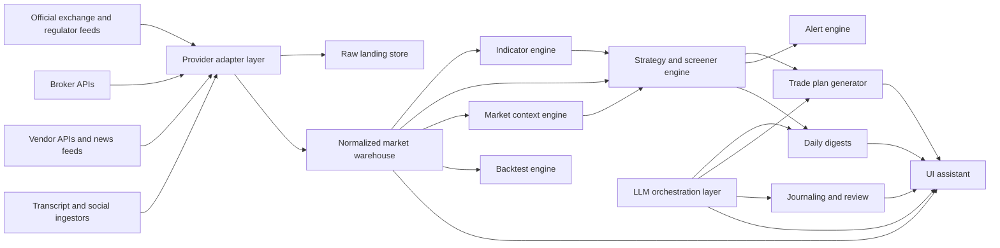
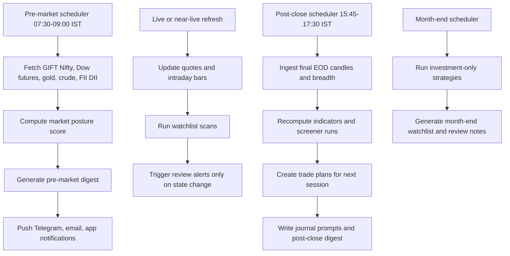

# Technical Design and Implementation Plan for an AI Assistant in an Indian Swing Trading Workflow

## Executive summary

The right way to build this assistant is not as a chatbot that “guesses trades,” and not as a brittle scraper glued to random websites. It should be a hybrid research and decision-support system with four hard layers: an exchange-first data layer, a deterministic screener/strategy engine, a portfolio-risk layer, and an LLM layer used mainly for synthesis, rationale generation, journaling, and briefing. That architecture matches both the spirit of your uploaded course materials and the strongest pattern extractable from the two videos you supplied. The first video, hosted on entity["company","YouTube","video platform"], is titled “How To Use Claude Routines For Investing” and appears to emphasize routines, alerts, and chained research prompts. The second is “How To Connect Claude to Trading View (Insanely Cool),” and its linked public resources show a local bridge between entity["company","TradingView","charting platform"] Desktop and Claude through a granular MCP/CDP tool layer, a `rules.json` watchlist and risk file, a “morning brief” workflow, and explicit safety checks before any action. citeturn3search0turn9search0turn6search0turn7search0turn8view0turn8view2turn8view3

Your uploaded documents push in the same direction. `prompt(1).md` defines the product as a course-informed “Investment Bible OS,” explicitly warns against scraping as the core intelligence layer, and frames the product as an educational analytical assistant rather than an execution autopilot. `gap-audit(1).md`, `strategy-dsl(1).md`, `cron-spec(1).md`, `market-context-model(1).md`, `screen-matrix(1).md`, and `testing(1).md` together show that the existing codebase is already conceived as a monorepo with a rule engine, screeners, worker pipelines, digest jobs, explainability, and a web/admin interface. That matters because this is not a greenfield design problem anymore. It is now a hardening, integration, data-quality, and compliance problem.

The most important implementation decision is this: keep the assistant manual-first. You should place trades manually by default. Optional broker hooks can prepare order tickets, risk-checked order intents, or a broker “review-and-submit” screen, but not silent execution. That is the safest operational choice and the cleanest regulatory choice in India under the current entity["organization","SEBI","market regulator india"] and exchange framework for retail algo participation. SEBI’s February 2025 circular created a retail algo framework, and the entity["organization","NSE India","stock exchange mumbai india"] implementation pages now explicitly describe “Client Direct API” and retail algo approval pathways. SEBI also separately warned against unregulated algo platforms making performance claims. citeturn15search1turn15search2turn15search0turn15search4turn25search0turn25search1

My bottom-line recommendation is a hybrid deployment: cloud-native core services for data ingestion, screening, storage, alerts, journaling, and backtests; plus a local optional sidecar only for chart-native workflows inspired by the TradingView video. For the India segment, the system should treat official exchange and regulatory data as the first source of truth, broker APIs as the operational interface, vendor APIs as redundancy and macro/global context, and social/transcript sentiment as low-trust context rather than primary signal input. citeturn13search3turn12search0turn13search4turn13search5turn16search7turn17search0turn18search13

### Assumptions

I am making these assumptions because your budget, exact compute limits, broker choice, and some “previous plan / recording summaries” were unspecified:

- The core tradable universe is Indian cash equities, not leveraged F&O execution.
- Options data is used for context and confirmation, not for direct options trading recommendations.
- Manual trade placement remains the default mode.
- The uploaded markdown files are the primary attached documents available to analyze; any unspecified attachments are treated as unavailable.
- I could identify the two video titles and extract meaningful workflow patterns from title/description snippets plus linked public repos/docs, but I did not have reliable direct transcript access to the full videos. citeturn3search0turn6search1turn7search0turn8view0turn8view2turn8view3

## Objectives and scope

The assistant should cover the entire daily and weekly swing workflow, not just screening. The uploaded `prompt(1).md` is right about that. If the system stops at “stocks that match conditions,” it is half-built. The end-to-end scope should be: market-context read, universe filtering, watchlist construction, strategy matching, entry/stop/target planning, position-size calculation, trade rationale generation, alerting, journaling, performance review, and compliance gating before any recommendation is displayed.

The strategy set implied by your uploaded notes is unusually clear and can be formalized directly. `strategy-source-matrix(1).md` maps active canonical rule families, including monthly Bollinger breakout, MBB, Buying in the Dips, Cross Strategy, ABC Strategy, Breakout, BTST, Trend Continuation, 13/34 with 200 SMA, 44 SMA, and 9/15 EMA plus SuperTrend on 4H. `screener-source-matrix(1).md` and `screener-registry(1).md` already map these to internal screener keys and bundle presets such as Month End Investment, Swing Daily Check, Breakout Radar, BTST Radar, and Strong Confluence Set. The assistant should preserve those families as explicit versioned rule sets instead of collapsing them into a single statistical model. That separation is important because your notes repeatedly insist on not mixing investing and swing logic blindly, and on keeping strategy families separate. 

There is also a hard philosophical constraint from your own material that should stay intact: context and filtering matter more than indicator stacking. `classnotes(1).md` and `prompt(1).md` repeatedly emphasize patience, structure, discipline, and context. So the assistant must not optimize for “maximum number of signals.” It should optimize for fewer, cleaner, more explainable candidates.

### What the assistant must do in practice

| Workflow stage | What the assistant should produce | How it should behave |
|---|---|---|
| Market research | Pre-market context panel, macro risk posture, sector breadth, FII/DII and global cue read | Deterministic score first, LLM explanation second |
| Watchlist generation | Daily, weekly, and month-end watchlists | Universe segmented by strategy family, sector, liquidity, and context |
| Signal generation | Matched setups by canonical strategy version | Rule-based first pass, ML score as secondary ranker |
| Entry and exit planning | Entry trigger, invalidation, stop, staged targets, trailing logic | No vague “bullish” labels without tradable levels |
| Position sizing | Quantity, rupee risk, portfolio heat impact | Enforce hard caps before displaying any trade plan |
| Risk management | Per-trade, portfolio, sector, event, and liquidity checks | Block or downgrade ideas that violate constraints |
| Trade rationale | Human-readable explanation and confidence breakdown | Cite which rules passed, which failed, and what remains ambiguous |
| Daily briefings | Pre-market, post-close, and month-end reports | Idempotent scheduled jobs, degradable if some providers fail |
| Alerts | Threshold, event, and “review required” alerts | Push only when a rule crosses from not-actionable to actionable |
| Journaling | Planned-vs-executed trade log and narrative | Capture setup, context, emotions, deviations, and outcomes |
| Performance analytics | Strategy attribution, expectancy, drawdown, regime fit | Show whether edge comes from one setup or from noise |
| India compliance checks | Display disclaimers, data provenance, broker/exchange limitations | Manual-first and no unregistered public advisory behavior |

One hard correction is necessary here. If you encode the old “2% portfolio risk rule” from the course as the default live setting, that is probably too aggressive for a multi-position swing book. Treat 2% as an upper emergency ceiling or educational reference, not the default. In a real portfolio with multiple correlated Indian equities, 0.5% to 1.0% per trade and a 3% to 5% total portfolio heat cap is far more defensible. Your notes should remain visible, but your production defaults should be stricter.

## Data sources, compliance, and source priority

The source hierarchy should be explicit and opinionated. For Indian swing trading, the first layer should be official exchange and regulator data; the second layer should be broker APIs; the third layer should be commercial vendor APIs for redundancy and global cues; the fourth should be unstructured news, transcript, and social sentiment. This ordering matters because the exchanges’ own pages and policies make clear that website content is governed by terms of use and commercial use often requires a separate data agreement. That means your production system should not be a scraper in disguise. It should be a provider-adapter system with licensing-aware routing. citeturn13search5turn13search6turn12search1turn13search0

### Recommended source priority

| Priority | Source class | Best use | Why it belongs there |
|---|---|---|---|
| Highest | entity["organization","NSE India","stock exchange mumbai india"] official reports/pages and entity["organization","BSE","stock exchange mumbai india"] bhavcopy/historical downloads | EOD prices, index data, 52-week highs/lows, option chain references, contract-wise FO data, FII/DII reports | Closest to source, best for EOD truth, breadth, and compliance-sensitive reporting |
| High | Broker APIs such as entity["company","Zerodha","broker api india"] Kite Connect and entity["company","Upstox","broker api india"] Developer API | Near-real-time quotes, historical candles, order-ticket preparation, positions and holdings | Best fit for live trading workflow and legally cleaner for user-authorized access |
| Medium | entity["company","Twelve Data","market data api"], entity["company","Financial Modeling Prep","market data api"], and entity["company","EODHD","market data api"] | Global cues, backup macro series, vendor redundancy, some fundamentals | Helpful, but should not outrank exchange/broker truth for Indian execution |
| Lower | News APIs, self-curated RSS, company announcements, analyst call transcripts | Event risk, narrative context, sentiment, catalyst extraction | Good for briefing and filtering, weak as standalone signal source |
| Lowest | Social sentiment from entity["company","X","social network"], entity["organization","Telegram","messaging platform"], and YouTube | Secondary sentiment and abnormal chatter | High noise, API instability, and manipulation risk |

The official Indian-source layer is strong enough for a serious EOD and pre-market assistant. NSE exposes FII/FPI and DII activity reports, price and volume data per security, historical index data, 52-week high/low pages, historical FO contract-wise data, and option-chain pages with downloadable CSVs. BSE exposes latest and historical bhavcopy for equity and derivatives. NSE’s own pages also point out that combined FII/FPI data is provisional and that final FPI data should be taken from entity["organization","NSDL","depository india"] or entity["organization","CDSL","depository india"]. citeturn12search0turn13search3turn13search4turn13search8turn13search1turn12search3turn12search5

The main legal/commercial catch is data usage. NSE’s terms and option-chain pages explicitly prohibit certain forms of aggregation/copying/reuse from the website, and the NSE Data policy says commercial access and redistribution require the relevant agreement and licensed use terms. So for production: use exchange downloads where allowed, use licensed market-data products when necessary, and use user-broker entitlements for operational data. Do not treat the public website as a free institutional data feed. citeturn12search1turn13search0turn13search5turn13search6

### Practical provider recommendation

| Provider | Strengths | Weaknesses | Role in your stack |
|---|---|---|---|
| entity["organization","SEBI","market regulator india"], NSE, BSE, NSDL/CDSL | Primary regulatory and market truth | Website/licensing constraints, not optimized for app-style low-latency streaming | Gold source for EOD, compliance, market structure tables, breadth, FII/DII, official reference |
| Zerodha Kite Connect | WebSocket quotes, historical candles, real order APIs, mature docs | Broker lock-in, some limits around expired derivatives history | Preferred broker adapter if you already use Zerodha |
| Upstox Developer API | Free API access posture, historical/market quote docs, option greeks, MCP integration docs | Need to verify operational policies broker by broker over time | Strong alternative broker adapter, especially for experimentation |
| Twelve Data | Broad global coverage, technical indicator APIs, India EOD coverage on listed plans | India real-time is not the core proposition; vendor dependency | Backup for global cues and supplementary fundamentals |
| FMP | Fundamentals, transcripts, global market data, institutional holdings datasets | Not India-first for cash equity execution | Good research-side enrichments, not the primary India execution feed |
| EODHD | Broad global EOD/intraday packages and predictable pricing | Data-source caveats and delayed/aggregated feed limitations on some markets | Cost-efficient backup or research mirror, not primary live execution truth |

Capabilities and restrictions in this table come from official provider docs or exchange pages. citeturn17search1turn17search0turn16search7turn16search8turn16search10turn18search13turn19search2turn21search1turn20search0turn20search2

### Unstructured sources and transcript sentiment

Use unstructured content, but stop pretending it is clean. The official YouTube captions API requires authorization to list or download caption tracks; it is not a general public transcript feed for arbitrary third-party videos. That means your production path should be: ingest user-supplied transcripts where available, otherwise run your own ASR on legally obtained audio, then store transcript segments with timestamps and source confidence. Telegram’s Bot API is simple and HTTP-based, which makes it easy to ingest messages from channels you control, but it does not solve legality or provenance by itself. X’s developer platform is now pay-per-use, which makes it suitable only if you have a clear sentiment ROI. citeturn22search0turn22search3turn22search4turn23search0turn23search2

### India-specific compliance posture

Your assistant must be designed so that it does not accidentally become an unregistered public advisory or public algo platform. SEBI’s research analyst and investment adviser regulations remain relevant if you start distributing paid personalized advice or public recommendation products. The platform should therefore display evidence, not promises; probabilities, not certainties; and should avoid claims of guaranteed performance. For optional future auto-execution, you will need to re-evaluate the design against the 2025 retail algo framework and broker/exchange implementation standards. citeturn14search2turn14search9turn15search1turn15search0turn25search1

## Technical architecture, ingestion, storage, and schemas

The uploaded design docs already point to the right architectural spine: versioned strategy DSL, provider adapters, scheduled pre-market and post-close jobs, explicit degraded mode, and explainability. `strategy-dsl(1).md` requires condition-by-condition output and canonical version tags. `cron-spec(1).md` requires lock keys, retries, `force=1`, degraded mode, and date-scoped auditability. `market-context-model(1).md` defines a factor-level posture score. `deployment(1).md` assumes Node, PostgreSQL, Next.js, and an optional worker. The clean move is to preserve that and extend it rather than reinvent it.

This architecture deliberately keeps the LLM above the deterministic engines, not inside them. That is exactly the right split for your use case. It also aligns with the TradingView MCP video’s “compact-by-default, granular-tools, rules-first” pattern and with your uploaded rule-engine documents. citeturn8view2turn8view3

### Data flow and orchestration

This schedule follows the job philosophy already present in `cron-spec(1).md`, but you should tighten the time windows. A practical target is: pre-market digest ready by 08:45 IST, post-close digest ready by 16:45–17:15 IST, and intraday manual rescan under 10 seconds for a 150–300 name universe on cached snapshots.

### Storage design

A simple but serious schema is enough. Use PostgreSQL for normalized transactional and analytical tables, plus object storage for bulk raw files and optional Parquet exports.

| Domain | Core tables |
|---|---|
| Reference data | `instrument_master`, `index_master`, `sector_taxonomy`, `corporate_actions`, `calendar_market_holidays` |
| Price and volume | `candle_eod`, `candle_intraday`, `quote_snapshot`, `volume_delivery_snapshot` |
| Derivatives context | `option_chain_snapshot`, `option_oi_surface`, `futures_snapshot` |
| Market context | `fii_dii_flow`, `breadth_snapshot`, `macro_snapshot`, `market_context_score` |
| Unstructured content | `news_article`, `article_entity`, `transcript_document`, `transcript_segment`, `sentiment_signal` |
| Rules and explainability | `strategy_definition`, `strategy_version`, `screener_definition`, `strategy_run`, `strategy_match`, `rule_trace` |
| Trading workflow | `watchlist`, `trade_plan`, `alert_event`, `journal_entry`, `execution_note`, `performance_snapshot` |
| Control plane | `provider_job_run`, `audit_event`, `provider_health`, `feature_flag` |

The important thing is not table count. It is provenance. Every derived signal should carry `provider`, `asof_timestamp`, `market_date`, `build_version`, and `strategy_version_tag`. Your uploaded DSL and cron docs already point in that direction.

### Ingestion rules

- Official EOD files should be immutable once archived.
- Intraday snapshots should be append-only, with later OHLC reconciliation jobs.
- Market context factors should be stored both raw and interpreted.
- Missing data should remain missing. Your `market-context-model(1).md` is correct on this. Do not impute missing provider values into “favorable” or “hostile.”
- Every scheduled pipeline must be idempotent with the `<job>:<marketDate>` lock key pattern already defined in `cron-spec(1).md`.

### Infrastructure options

| Option | Good fit | Bad fit | Verdict |
|---|---|---|---|
| Pure cloud | EOD research, digests, journaling, alerts, backtests | Local chart-native TradingView workflows | Good for the core system, not for deep chart automation |
| Pure on-prem | Sensitive local-only workflows, low recurring cloud spend | Operational burden, backups, uptime, mobile access | Wrong default unless you enjoy babysitting infra |
| Hybrid local plus cloud | Cloud core plus local TradingView/broker sidecar | Slightly higher complexity | Best overall architecture |

The hybrid verdict follows directly from the second video’s local TradingView bridge pattern and from the reality that your broader research stack, notifications, and journaling benefit heavily from managed cloud infrastructure. citeturn7search0turn8view0turn29search1turn30search0

## Models, decision logic, explainability, and risk

The signal engine should be layered, not monolithic.

### Model stack

| Layer | Recommended approach | Why | Main downside |
|---|---|---|---|
| Baseline signal generation | Deterministic rules from your strategy DSL | Faithful to your course logic, backtestable, auditable | Can be rigid and miss edge cases |
| Ranking and prioritization | Gradient-boosted trees on tabular features | Excellent for cross-sectional ranking with heterogeneous features | Needs careful leakage control |
| Regime classification | Simple probabilistic regime model or hidden-state classifier | Useful for switching aggressiveness and strategy mix | Easy to overfit if you add too many macro inputs |
| NLP summarization | LLM summarizer with source-grounded prompts | Best for briefings, rationale, and journal summaries | Hallucinates if you let it touch raw signals unsupervised |
| Sentiment scoring | Smaller classifier plus lexicon/embedding features | Cheap and robust enough for news/transcript polarity | Weak on sarcasm, pump groups, and multilingual nuance |

The uploaded strategy set is too structured to throw away. So the first generation should preserve explicit strategies as canonical families and use ML only to rank candidates within each family. For example, the Breakout family can remain rule-gated, while a GBDT ranker orders qualified names by historical breakout quality, context alignment, liquidity, and follow-through probability.

### Feature engineering

Your notes already imply many features, and your `gap-fill-prompt.md` asks for the missing helper functions that support them: Fibonacci, structure detection, relative volume, consolidation, aggregation, and 52-week distance. That is exactly the right feature backlog.

Use these feature groups:

- **Technical structure:** RSI 14, SMA/EMA ladders, Bollinger position, ATR, SuperTrend, candle body percent, HH/HL and LH/LL state, relative volume, distance from 52-week high, base compression score.
- **Context:** Nifty regime, sector trend, GIFT Nifty, Dow futures, gold, crude, FII/DII, breadth, delivery percentage, holiday/expiry proximity.
- **Fundamental quality:** profitability growth, sales growth, debt profile, institutional ownership stability, mutual-fund common-holdings score.
- **Derivatives context:** OI change by nearest strikes, put-call OI skew, futures basis, unusual OI build-up. Use this only as a context feature for cash-equity swing names.
- **Unstructured sentiment:** event type, promoter/legal/governance risk flags, earnings tone, management optimism, abnormal social chatter z-score.
- **Execution quality:** spread proxy, volume bucket, gap risk, earnings date proximity, overnight event exposure.

One thing worth saying bluntly: options flow, social sentiment, and transcript sentiment should not outrank price-and-volume structure in this workflow. That would be a category mistake. Your own course notes are price-structure-first and context-second.

### Decision logic

The assistant should compute three separate outputs for every candidate:

1. **Eligibility score**  
   Rule-gated. If hard conditions fail, the stock is not actionable.

2. **Quality score**  
   Weighted by structure, context, liquidity, and event cleanliness.

3. **Execution score**  
   Based on stop distance, slippage risk, overnight event risk, and portfolio heat impact.

A simple practical formula is:

- `eligibility` = boolean from hard-rule pass
- `quality` = 0–100 weighted composite
- `execution` = 0–100 weighted composite
- `confidence` = calibrated probability bucket derived from historical forward outcomes for that exact strategy family and regime

The explanatory output should never be generic. It should say things like:

- “Matched `breakout.v1.canonical` because candle body was 74%, close was 1.4% above resistance, relative volume was 1.8x, delivery was 38%, and market posture was favorable.”
- “Downgraded because earnings are within 2 sessions and sector breadth is deteriorating.”
- “Position size reduced because stop distance implies portfolio heat breach.”

That structure mirrors the `rule_trace` approach described in `strategy-dsl(1).md`.

### Risk management and sizing

Use hard constraints first, then sizing math.

| Rule | Recommendation |
|---|---|
| Per-trade capital risk | Default 0.5% to 1.0% of equity; allow 2.0% only as an advanced override |
| Max portfolio heat | 3% to 5% total open risk |
| Max correlated exposure | 2 names per sector unless exceptionally liquid and uncorrelated |
| Event blockers | No fresh swing entries one day before results, major corporate actions, or known binary events |
| BTST blockers | Follow your notes: avoid Friday, holiday-eve, and expiry-adjacent cases unless explicitly allowed |
| Liquidity floor | Equity cash only; enforce minimum median traded value and delivery thresholds |
| Stop logic | Structural stop first, ATR sanity check second |
| Trail logic | Use strategy-native trail, not one universal trail |

Position size formula:

\[
\text{shares}=\left\lfloor \frac{\text{equity}\times \text{risk\_pct}}{\max(\text{entry}-\text{stop}, \text{min\_risk\_unit})} \right\rfloor
\]

But add two extra checks that your notes did not formalize well enough:

- **Gap-risk adjustment:** reduce size if overnight ATR or event-risk percentile is high.
- **Portfolio-heat adjustment:** clip size if the new trade pushes aggregate open risk above the cap.

The course’s 3R framing remains useful, but no system should auto-attach a 3R target to every setup blindly. For trend continuation and 44-SMA pullbacks, a structure-based trailing exit may dominate a fixed 3R take-profit.

## Validation, UX, automation, and operations

Your uploaded `testing(1).md` correctly emphasizes deterministic strategy runs, degraded digest mode, and screener set math. I would extend that into a four-stage validation program.

### Validation plan

| Stage | Goal | Acceptance bar |
|---|---|---|
| Unit and rule tests | Verify all indicator helpers, DSL validation, and rule traces | 95%+ pass on deterministic fixtures |
| Historical backtests | Verify every strategy family separately | No strategy promoted without out-of-sample edge and drawdown profile |
| Walk-forward tests | Prevent temporal leakage | Minimum 3 walk-forward windows with stable rank ordering |
| Paper trading | Test operational decision quality and alert noise | 6 to 8 weeks with journaled decisions and manual execution feedback |

Backtesting must be strategy-family-specific. Do not backtest “the assistant” as one giant black box. Backtest `breakout.v1.canonical`, `abc-strategy.v1.canonical`, `sma-44.v1`, and so on independently, then compare behavior by regime and by market-cap bucket. Your uploaded `strategy-source-matrix(1).md` already gives the versioning backbone required for this.

### Metrics that actually matter

Track:

- expectancy in R,
- win rate,
- average winner and loser in R,
- initial stop hit rate,
- max adverse excursion,
- time-to-target,
- heat-adjusted return,
- strategy-by-strategy contribution,
- regime-by-regime contribution,
- alert-to-trade conversion rate,
- plan adherence rate,
- slippage between planned and actual manual execution,
- false-positive rate around earnings and event windows.

If you are not tracking plan adherence and false positives, your journaling layer is decorative, not useful.

### UI and integrations

The uploaded `screen-matrix(1).md` suggests the product already wants dashboard, digest archive, strategy detail, screener lab, references, risk calculator, backtests, CMS, and observability. Keep that structure. The most important UI surfaces are:

- **Pre-market dashboard:** context posture, global cues, FII/DII, overnight gap watchlist, pending alerts.
- **Screener lab:** intersections, exclusions, overlap explanation, and saved bundles.
- **Strategy detail:** raw rule logic, normalized canonical version, ambiguity notes, and recent matches.
- **Trade planner:** entry, stop, targets, size, heat impact, and rationale.
- **Journal review:** plan vs actual, screenshot, notes, outcome, and lesson.
- **Analytics board:** expectancy, drawdown, strategy contribution, and regime map.

For mobile, keep it brutally simple: digest cards, high-priority alerts, and trade-plan review. Do not try to recreate the full desktop lab on mobile.

For broker integration, default to manual review. The system should generate a broker-ready order ticket payload for Zerodha or Upstox, but require explicit user confirmation. Optional future hooks can place orders through broker APIs, but that should be ring-fenced behind a separate “regulated/operational review required” milestone because the compliance burden changes materially once you cross into execution. Broker docs clearly support real-time orders, quotes, and historical data, but operational and regulatory constraints still evolve. citeturn17search1turn17search0turn16search8turn16search10turn18search13

### Security, privacy, and operational controls

Use least privilege everywhere. Provider keys must stay server-side, which your uploaded `env.md` already says explicitly. The system should isolate broker credentials, encrypt secrets at rest, maintain audit events for cron runs and admin actions, and expose provider-health status. On the privacy side, if you store identifiable personal content such as phone numbers, emails, or copied Telegram/X user data, you move into Indian data-protection territory and should design for notice, purpose limitation, retention, and secure deletion. The entity["organization","Ministry of Electronics and Information Technology","india tech ministry"] explanatory note to the DPDP Rules emphasizes clear notices, purpose-specific processing, and easy withdrawal where consent is involved. citeturn28search16turn28search17turn26search3

## Timeline, staffing, cost, deliverables, risks, and next steps

The uploaded docs imply a codebase that is already far enough along to avoid a “build everything” timeline. The realistic plan is an integration-and-hardening program.

### Proposed milestone plan

| Milestone | Duration | Deliverables | Acceptance criteria |
|---|---:|---|---|
| Foundation hardening | 2 weeks | Finalize DSL validation, rule traces, provider interface, schema freeze | Deterministic tests pass; every strategy version has canonical tag and explanation trace |
| Data and market-context integration | 2 to 3 weeks | NSE/BSE/NSDL-CDSL ingestors, broker adapter, context scoring, raw landing pipelines | Pre-market and post-close jobs produce auditable outputs with degraded mode |
| Strategy and planner engine | 3 weeks | Full strategy runs, watchlist bundles, trade planner, risk caps, alerts | Daily manual workflow usable without LLM; all candidate plans include stop and size |
| Briefings, journaling, and analytics | 2 weeks | Pre/post/month-end digests, journal prompts, analytics dashboard | Journal loop closes from signal to outcome; analytics usable by strategy family |
| Backtests, paper trading, and launch hardening | 3 weeks | Walk-forward harness, paper trading mode, monitoring, dashboards, docs | 6-week paper-trade readiness and production runbook complete |

That is roughly a 12-week serious MVP if one senior engineer drives the core and a second contributor handles frontend or data plumbing part-time. If you want this done properly, not cosmetically, budget for roughly 18 to 28 person-weeks.

### Staffing estimate

| Role | Needed effort | Why |
|---|---:|---|
| Quant/product engineer | Full-time | Own strategy engine, validation, signal ranking, risk logic |
| Full-stack engineer | Full-time or strong part-time | Next.js app, APIs, auth, dashboards, broker adapters |
| Data engineer | Part-time | Ingestion reliability, warehouse hygiene, raw-to-normalized flow |
| UI/UX engineer | Part-time | Dense but usable dashboards and mobile alert review flows |
| QA/automation | Part-time late stage | Regression, Playwright, acceptance harness |
| Compliance-aware reviewer | Advisory | Sanity-check public wording, disclaimers, and execution hooks |

### Cost ballpark

A lean monthly cost for a private single-user or small-team deployment is surprisingly manageable if you keep the system mostly EOD plus light intraday refresh. A realistic low-end cloud bill is roughly one paid entity["company","Supabase","backend platform"] organization, one hobby or small pro deployment on entity["company","Railway","app deployment platform"], and optionally a small entity["company","Upstash","serverless redis provider"] instance for locks and queues. That puts core infrastructure roughly in the tens of dollars per month before vendor data. Supabase’s paid plan starts at $25 with usage-based compute and overage models; Railway’s hobby plan starts at $5; Upstash Redis can start at free or $10 fixed; and vendor data packages range from roughly $20–$30 per month for lighter EOD tiers into $60–$150+ for broader fundamentals and commercial-grade access. citeturn30search0turn30search2turn29search1turn29search2turn20search0turn21search2

A practical monthly budget range is:

| Configuration | Monthly range | What it covers |
|---|---:|---|
| Lean private MVP | $40–$120 | Core cloud, official-source ingestion, broker API, minimal vendor redundancy |
| Research-grade build | $150–$600 | Core cloud plus one or two vendor APIs, better observability, heavier backtests |
| Redundant production-grade multi-source stack | $600–$2,000+ | Multiple data vendors, stronger monitoring, higher compute, longer intraday retention |

Exchange licensing, commercial redistribution rights, and premium broker or data-display arrangements can blow past these numbers quickly. That is exactly why the architecture should stay manual-first and private-user-first unless you have a clear commercialization plan.

### Main risks and mitigation

| Risk | Why it is serious | Mitigation |
|---|---|---|
| Data-license breach | NSE/BSE website terms are not a free pass for app-scale reuse | Use licensed feeds where required; avoid scraping-first design |
| False confidence from LLM text | Nice prose can hide bad signals | Keep LLM downstream of rule engine; never let it invent entries or stops |
| Strategy drift | Notes, raw shorthand, and normalized versions can diverge | Preserve canonical version tags and ambiguity ledger |
| Overfitting | Too many features, too little discipline | Separate rule gating from ML ranking and enforce walk-forward validation |
| Operational inconsistency | Worker routes and APIs can drift | Use one canonical pipeline contract with idempotent cron and audit logs |
| Regulatory creep | Manual assistant can become de facto advisory or algo product | Keep manual execution default and harden disclaimers and auditability |

### Next steps

The immediate next step is not “add more AI.” It is to lock the rule and data contracts. Specifically:

- finalize the canonical strategy registry and ambiguity ledger,
- implement exchange-first provider adapters,
- enforce idempotent pre-market/post-close jobs,
- build the trade planner and heat-aware position sizer,
- then add the LLM briefing and journaling layer on top.

If you do it in the reverse order, you will get a flashy assistant that sounds smart and trades badly. That is the wrong build.

The strongest synthesis of your materials is this: your course notes provide the deterministic edge shape; the videos provide the modern AI workflow pattern; the uploaded codebase docs already define the product spine. The system you need now is a rigorous, explainable, compliance-aware trading operating system for Indian swing workflows, with AI as an analyst and narrator, not as an unchecked decision-maker.