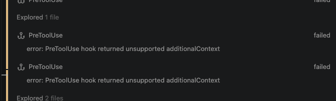
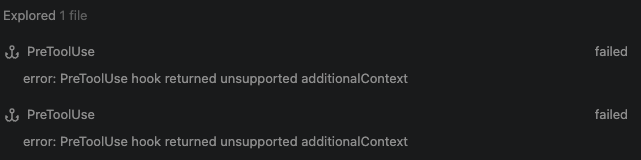

# Investment Bible OS — Ultra Master Prompt for Claude Code / Codex

## How to use this file

Copy everything from **`BEGIN MASTER PROMPT`** to **`END MASTER PROMPT`** into Claude Code or Codex.

This prompt is intentionally exhaustive. It is designed to produce an end-to-end, scalable **market digest + screener intersection + strategy intelligence + learning system** based on Arindam’s stock market course notes and the user’s workflow.

---

# BEGIN MASTER PROMPT

You are an elite principal engineer, principal product architect, senior quant-product systems designer, and full-stack technical lead.

Your job is to design and implement an **end-to-end web application** called:

# Investment Bible OS

This is a **personal market digest + screener engine + strategy intelligence + learning reference system** for an Indian equity-cash-market learner/investor who is following a structured stock-market course from **Arindam**.

The user does **not** have time to watch the market all day.

So this software must become the user’s:

- daily market digest
- rule-based screener engine
- strategy explainer
- strategy evaluator
- stock shortlist engine
- pre-market context reader
- course knowledge base
- evolving investing playbook
- later-ready holdings and portfolio assistant

This is **not** a generic trading dashboard.
This is a **course-informed investing operating system**.

You must build it as a serious, scalable, production-grade software system.

Do not create a shallow UI that just opens links.
Do not create a tab launcher.
Do not create a toy screener.

Build the actual product.

---

# 1. Product truth you must understand before coding

The source material comes from handwritten notes plus structured summaries of course sessions.

### Sessions 1–3
Mostly foundational:
- market basics
- debt vs equity
- exchange structure
- broker/demat/trading
- technical vs fundamental analysis
- candle anatomy
- moving averages
- MACD
- chart patterns
- trend structure
- candlestick basics

### Session 4
Bridge from pattern-reading to structure-reading:
- support/resistance as zones
- order blocks
- supply and demand zones
- DBR / RBR / RBD / DBD
- stop-loss hunting / liquidity hunts
- patience and discipline
- reaction areas over exact lines

### Session 5
Trading system design:
- stock selection
- strategy
- stop-loss
- target
- trailing
- position sizing
- risk management
- psychology
- RSI
- Fibonacci
- 3:1 reward-to-risk framing
- 2% portfolio risk rule
- quantity = (0.02 * portfolio_size) / (entry - stop_loss)

### Session 6
Investment strategy block:
- investing is different from trading
- monthly chart matters for investing
- Multi-Bagger Breakout (MBB)
- Bollinger Band Monthly Breakout Strategy (BB)
- month-end evaluation
- scanner-driven discipline
- conviction and fundamentals matter

### Session 7
Swing trading:
- Buying in the Dips
- Cross Strategy
- monthly RSI as higher-timeframe filter
- daily execution
- Nifty as directional filter
- bulls slow, bears fast
- divergence as supporting evidence
- scanners required

### Session 8
Pre-market context + ABC strategy:
- GIFT Nifty / earlier SGX Nifty reference
- Dow Jones
- E-mini Dow Futures (`YM1!`)
- Gold
- Crude Oil
- FII/FPI as confluence, not primary trigger
- ABC strategy:
  - 50 SMA
  - Lower Bollinger Band interaction
  - Green Candle
- +1% confirmation above trigger
- stop-loss at daily swing low
- trail using 50 SMA
- equity cash only, not F&O

### Session 9
Advanced swing ideas:
- Breakout strategy
- BTST
- Alpha/Beta screening workflow
- Trend Continuation Strategy
- 13/34 SMA + 200 SMA setup
- 44 SMA strategy
- 9/15 EMA + Super Trend on 4H
- mutual-fund-based stock discovery
- execution discipline over indicator overload

### Important behavioral core across all sessions
The real edge is not “secret indicators.”
The real edge is:
- structure
- patience
- discipline
- context
- strict filtering
- risk control
- capital preservation
- not mixing investing and swing logic blindly

The site must reflect this philosophy in its architecture.

---

# 2. Core product objective

Build one unified system where the user can do all of the following from one place:

1. Read the daily market digest
2. See pre-market context
3. See what changed in the market today
4. Run internal strategy screeners
5. Compare multiple screeners at once
6. See the intersection of screener outputs
7. See why each stock matched
8. See the exact rule logic for each strategy
9. See the supporting learning notes from the course
10. Decide whether a stock is:
   - investment candidate
   - swing candidate
   - not actionable
11. View rule-based explanations, not just signals
12. Save watchlists
13. Save notes
14. Backtest strategies
15. Add future strategies from later course sessions without breaking the system
16. Maintain a clean knowledge base of all course concepts and rules
17. Be ready later for holdings upload, portfolio review, alerts, and personal trade journal

This must be a true **Investment Bible**.

---

# 3. Product boundaries and truthfulness rules

This product must **not** pretend certainty.

It must not say:
- “buy this now”
- “guaranteed winner”
- “high certainty”
- “safe trade”

It may say:
- matched strategy rules
- matched screener rules
- market context favorable / neutral / hostile
- confluence score
- rule confidence
- source confidence
- incomplete data warning
- ambiguous strategy threshold warning

The product is an educational and analytical assistant.
It is not a SEBI-registered advisor.
It is not an execution autopilot.
It is not a brokerage terminal.

Add clear disclaimers:
- educational and analytical software
- no guaranteed returns
- user remains decision-maker
- data delay / provider limitations may exist
- some rules are reconstructed from educational material and may contain ambiguity

---

# 4. Architecture direction you must follow

Use a scalable monorepo.

## Required stack
- **Frontend**: Next.js (App Router) + TypeScript
- **UI**: Tailwind CSS + shadcn/ui + accessible, dense-but-clean data layouts
- **Backend/API**: Next.js route handlers OR separate Node service if needed, but keep architecture modular
- **Database**: PostgreSQL on Supabase
- **ORM**: Prisma
- **Auth**: Supabase Auth or simple app auth abstraction with future multi-user readiness
- **Background jobs / cron**:
  - primary recommendation: dedicated worker service
  - production options:
    - Render cron / worker
    - Railway background worker
    - or Vercel cron only for light triggers
- **Queue / cache**:
  - Redis / Upstash strongly preferred for job fanout, caching, dedupe, lock control
- **Charts**:
  - TradingView-style experience where legally and technically acceptable
  - lightweight charting for OHLC, indicators, overlays
- **Testing**:
  - unit tests
  - integration tests
  - strategy rule tests
  - data adapter tests
  - Playwright E2E
- **Observability**:
  - Sentry
  - structured logs
  - job run audit logs
  - provider failure dashboards

Do not build a tangled single-app mess.
Use clean modules.

---

# 5. Monorepo structure you must implement

Use a structure approximately like this:

```txt
investment-bible-os/
  apps/
    web/
      app/
      components/
      features/
      lib/
      hooks/
      styles/
      public/
      tests/
    worker/
      src/
        jobs/
        providers/
        indicators/
        strategies/
        digest/
        pipelines/
        utils/
      tests/
  packages/
    config/
    db/
    ui/
    types/
    utils/
    indicators/
    strategy-engine/
    screener-engine/
    data-sources/
    market-context/
    backtest-engine/
    course-knowledge/
  prisma/
    schema.prisma
    migrations/
    seed.ts
  docs/
    architecture/
    api/
    strategy-specs/
    provider-notes/
    data-dictionary/
  scripts/
    bootstrap/
    import/
    verify/
  .env.example
  turbo.json
  package.json
  pnpm-workspace.yaml
  README.md
```

You may improve this structure if needed, but keep equivalent separation of concerns.

---

# 6. Core system modules

You must design the system as a set of cooperating modules.

## 6.1 Market Data Layer
Purpose:
- fetch EOD and, where possible, near-real-time or delayed market data
- normalize symbol metadata
- normalize OHLCV
- normalize index data
- normalize macro references
- normalize institutional flow
- normalize source timestamps and freshness

## 6.2 Indicator Engine
Purpose:
- compute indicators consistently and centrally
- never duplicate indicator formulas across the app

Indicators required from course inputs:
- RSI
- SMA
- EMA
- Bollinger Bands
- VWAP
- Super Trend
- ATR
- Fibonacci retracement helpers
- delivery percentage fields where available
- relative volume
- higher high / higher low structure markers
- lower high / lower low structure markers
- monthly aggregation helpers
- weekly aggregation helpers
- 52-week high / low helpers
- long consolidation detectors

## 6.3 Strategy Engine
Purpose:
- evaluate strategy rules deterministically
- support rule versioning
- support rule source provenance
- support ambiguity handling
- support future strategy additions from later course sessions

## 6.4 Screener Engine
Purpose:
- run internal scans
- store screener definitions
- support multiple screener selection
- compute intersections, unions, exclusions
- explain why each stock is included

## 6.5 Market Digest Engine
Purpose:
- produce daily summary
- pre-market and post-market summary
- summarize global cues
- summarize institutional flow
- summarize strategy matches
- summarize top watchlist changes
- summarize new signals

## 6.6 Course Knowledge Engine
Purpose:
- store the course notes, summaries, rule explanations, ambiguities, strategy definitions, and learning notes
- allow strategy pages to show “learn why this exists”

## 6.7 Backtesting Engine
Purpose:
- replay strategies on historical data
- track win rate, drawdown, hold time, false breakout rate, etc.
- compare versions of strategy rules

## 6.8 Personal Workspace
Purpose:
- saved watchlists
- saved notes
- later-ready holdings upload
- later-ready portfolio review
- later-ready trade journal
- later-ready alert preferences

## 6.9 Admin / Strategy CMS
Purpose:
- add new strategies
- edit thresholds
- mark strategy version as draft / active / deprecated
- attach course session references
- attach source URLs
- attach ambiguity notes
- attach risk notes
- attach backtest profiles

---

# 7. Critical architectural principle: do NOT rely on scraping as the brain

The site must not depend on brittle scraping from third-party screener sites as the core engine.

Build internal rule engines.

Use external URLs as:
- references
- comparison points
- backup research surfaces
- manual import sources when necessary

But the primary intelligence must be internal and deterministic.

### Correct approach
- recreate core screeners as internal rule definitions
- create source-reference cards for external screener pages
- support optional manual symbol import from external lists
- support provider adapters for documented APIs
- never build the product around fragile HTML scraping as its only strategy layer

If a specific site legally or technically blocks automation, the app must still work.

---

# 8. External sources and provider strategy

Build the product with a **provider-adapter architecture**.

Each provider must implement:
- health check
- auth config
- rate limit config
- fetch methods
- data freshness metadata
- normalized error handling
- fallback behavior

## 8.1 Provider categories

### Category A — Official / primary market and exchange sources
Use where possible:
- NSE official market data products / reports
- NSE FII/FPI and DII reports
- NSE security-wise / historical reports
- NSE 52-week high / low references
- official index and instrument metadata where feasible

### Category B — Broker / trading platform APIs
Optional adapters:
- Zerodha Kite Connect
- Upstox Developer API
- Shoonya API
- future-ready for others

These should be optional connectors.

### Category C — Market data vendors
Optional documented adapters:
- Twelve Data
- Financial Modeling Prep (FMP)
- EODHD
- other vendor adapters behind a consistent interface

### Category D — Manual/reference sources
Use as reference surfaces or manual import sources:
- Chartink scans
- Economic Times technical pages
- Moneycontrol top gainers / volume shockers
- ICICI Direct calculators
- Chittorgarh for historical IPO context
- other course-mentioned links

---

# 9. URLs that must be preserved inside the product as source references

You must preserve, catalog, and expose these URLs in the app under a “Source References” or “External References” section.

## User-provided screener and reference URLs
- https://chartink.com/screener/investment-bb-strategy
- https://chartink.com/screener/bb-strategy
- https://chartink.com/screener/tc-long-1
- https://chartink.com/screener/supertrend-in-green-and-green-candle-in-4-hour-chart-above-9-and-15-ema
- https://chartink.com/screener/sma-13-34-scan-2
- https://chartink.com/screener/20-day-breakout-stocks
- https://chartink.com/screener/44-ma-7869488307
- https://economictimes.indiatimes.com/stocks/marketstats-technicals/rsi-above-80
- https://www.icicidirect.com/calculators/future-value-calculator
- https://www.nseindia.com/market-data/52-week-high-equity-market
- https://www.moneycontrol.com/stocks/market-stats/top-gainers-nse/
- https://www.moneycontrol.com/stocks/market-stats/volume-shockers-nse/
- https://www.chittorgarh.com/

## Official / documented provider references that must be captured in provider notes
- https://www.nseindia.com/static/all-reports/historical-equities-fii-fpi-dii-trading-activity
- https://www.nseindia.com/static/market-data/real-time-data-subscription
- https://kite.trade/
- https://kite.trade/docs/connect/v3/
- https://upstox.com/developer/api-documentation/v3/get-historical-candle-data/
- https://shoonya.com/api-documentation
- https://twelvedata.com/stocks
- https://twelvedata.com/indices
- https://twelvedata.com/fundamentals
- https://site.financialmodelingprep.com/developer/docs
- https://eodhistoricaldata.com/
- https://eodhistoricaldata.com/financial-apis/technical-indicators-api/
- https://chartink.com/articles/scanner/scanner-user-guide/

Important:
- Store these in the database as reference records
- Show them inside an “Implementation References” admin page
- Tag each as:
  - official
  - broker
  - vendor
  - user reference
  - calculator
  - screener
  - manual source

---

# 10. Data model expectations

You must create a proper Prisma schema.

## 10.1 Main entities
At minimum, define entities like:

- User
- Workspace
- Instrument
- Exchange
- Sector
- InstrumentAlias
- DailyBar
- WeeklyBar
- MonthlyBar
- IndexBar
- MacroSeriesPoint
- InstitutionalFlow
- DeliveryStats
- IndicatorSnapshot
- Strategy
- StrategyVersion
- StrategyCondition
- StrategyRun
- StrategyMatch
- Screener
- ScreenerVersion
- ScreenerRun
- ScreenerResult
- ScreenerIntersectionRun
- Digest
- DigestSection
- Watchlist
- WatchlistItem
- Note
- BacktestRun
- BacktestTrade
- BacktestMetric
- DataProvider
- ProviderSyncRun
- SourceReference
- CourseSession
- CourseTopic
- StrategyLearningNote
- HoldingUploadBatch
- HoldingPosition
- JobRun
- AuditEvent
- AlertRule
- AlertEvent

## 10.2 Core metadata every strategy must store
Each strategy version must store:
- name
- slug
- type (`investment`, `swing`, `intraday`, `context`, `risk`, `learning_only`)
- timeframe
- rule_json
- explanation_md
- source_session_ids
- source_confidence (`high`, `medium`, `low`)
- ambiguity_notes
- enabled
- version_number
- status (`draft`, `active`, `deprecated`)
- created_at
- activated_at

## 10.3 Ambiguity support is mandatory
Some course rules conflict between handwriting and cleaned summaries.

Example:
- BB strategy handwritten note suggests `Price > 50`, `Monthly RSI > 55`
- cleaned summary normalizes this more safely to `Price >= 100`, `Monthly RSI >= 50`

The system must support:
- raw note version
- normalized version
- active implementation version
- explanation of why active version was chosen

This is critical.
Do not hardcode ambiguous logic without provenance.

---

# 11. Prisma schema draft requirements

Create a serious `schema.prisma` with:
- enums
- indexes
- composite unique keys
- JSON fields where rule DSL is stored
- audit timestamps
- foreign-key integrity
- soft delete fields where useful
- optional partitioning strategy notes in comments for OHLCV tables

### Required enums to include
At minimum:
- StrategyType
- StrategyStatus
- RunStatus
- MatchDirection
- MarketContextBias
- DataFreshnessState
- SourceReferenceType
- JobType
- JobStatus
- AlertChannel
- InstrumentClass

### Important database design rule
OHLCV history will become large.
Design for scale:
- composite indexes on `(instrument_id, date)`
- separate daily / weekly / monthly tables
- avoid over-normalizing hot paths
- cache derived snapshots where needed

---

# 12. API surface you must implement

Create a clean internal API.

Use typed contracts.

## 12.1 Required API groups

### Market / Digest
- `GET /api/digest/today`
- `GET /api/digest/premarket`
- `GET /api/digest/postmarket`
- `GET /api/market/context`
- `GET /api/market/indexes`
- `GET /api/market/macro`
- `GET /api/market/institutional-flow`

### Instruments
- `GET /api/instruments`
- `GET /api/instruments/:symbol`
- `GET /api/instruments/:symbol/chart`
- `GET /api/instruments/:symbol/indicators`
- `GET /api/instruments/:symbol/strategy-matches`

### Strategies
- `GET /api/strategies`
- `GET /api/strategies/:slug`
- `GET /api/strategies/:slug/version/:version`
- `POST /api/strategies/:slug/run`
- `POST /api/strategies/:slug/backtest`

### Screeners
- `GET /api/screeners`
- `GET /api/screeners/:slug`
- `POST /api/screeners/run`
- `POST /api/screeners/intersection`
- `POST /api/screeners/manual-import`
- `GET /api/screeners/runs/:id`

### Backtests
- `POST /api/backtests/run`
- `GET /api/backtests/:id`
- `GET /api/backtests/:id/trades`
- `GET /api/backtests/:id/metrics`

### Watchlists / Notes
- `GET /api/watchlists`
- `POST /api/watchlists`
- `POST /api/watchlists/:id/items`
- `DELETE /api/watchlists/:id/items/:itemId`
- `GET /api/notes`
- `POST /api/notes`

### Holdings (future-ready)
- `POST /api/holdings/upload`
- `GET /api/holdings/current`
- `GET /api/holdings/analysis`

### Admin
- `POST /api/admin/provider-sync`
- `POST /api/admin/strategy-version`
- `POST /api/admin/screener-version`
- `POST /api/admin/source-references`
- `POST /api/admin/course-sessions/import`
- `POST /api/admin/recompute-indicators`

---

# 13. API contract JSON requirements

For the important endpoints, include example request/response JSON in docs.

## Example: screener intersection request
```json
{
  "screenerSlugs": [
    "investment-bb-strategy",
    "rsi-above-80",
    "nse-52-week-high"
  ],
  "mode": "intersection",
  "asOfDate": "2026-04-16",
  "filters": {
    "minPrice": 100,
    "minVolume": 100000,
    "sectorIn": [],
    "excludeWatchlistSymbols": []
  }
}
```

## Example: screener intersection response
```json
{
  "runId": "scr_inter_001",
  "mode": "intersection",
  "asOfDate": "2026-04-16",
  "totalCandidates": 5,
  "results": [
    {
      "symbol": "ABC",
      "companyName": "ABC LTD",
      "matchedScreeners": [
        "investment-bb-strategy",
        "rsi-above-80",
        "nse-52-week-high"
      ],
      "matchReasons": [
        "Monthly high crossed upper Bollinger Band",
        "Monthly RSI above threshold",
        "Near 52 week high"
      ],
      "contextBias": "BULLISH",
      "strategyBuckets": ["investment", "swing_watch"],
      "riskFlags": [],
      "learningLinks": [
        "session-6-bb-strategy",
        "session-7-rsi-context"
      ]
    }
  ]
}
```

Produce many such contracts in the docs.

---

# 14. Core strategies that must be implemented from day one

These strategies must become first-class citizens.

## 14.1 Session 5 — System / risk engine
Not a stock-picking strategy but a universal engine.

Implement:
- 2% portfolio risk calculator
- quantity formula
- 3R target calculator
- entry / stop / target worksheet
- trailing stop recommendation framework
- risk classification component
- “why quantity is this number” explanation box

## 14.2 Session 6 — Multi-Bagger Breakout (MBB)
Implement as investment strategy.

### Raw concept
- identify stocks with multi-year sideways / dead period
- draw long-term range
- detect structural breakout
- verify momentum using RSI

### Product requirement
Because this is hard to fully automate perfectly, implement:
- heuristic detector
- visual explanation
- manual review mode
- confidence score
- breakout range display
- note that this is semi-heuristic

Fields:
- consolidation start/end
- range high/low
- breakout month
- monthly RSI
- confidence
- false breakout guard

## 14.3 Session 6 — Bollinger Band Monthly Breakout (BB)
Implement as the first strong canonical strategy.

### Active normalized rule set
Use this as the default active version:
- price >= 100
- daily volume >= 100000
- monthly RSI >= 50
- monthly high crosses upper Bollinger Band
- evaluated only on completed monthly candle
- entry = 1% above trigger
- stop-loss = recent daily swing low
- exit/trail = Super Trend

### Also preserve source ambiguity
Store the handwritten alternative:
- price > 50
- monthly RSI > 55

UI must show:
- active version
- raw note version
- why active version chosen

## 14.4 Session 7 — Buying in the Dips
Implement as swing strategy.

### Canonical rule
- monthly RSI >= 60
- shift to daily chart
- detect controlled dip in ongoing uptrend
- entry on bullish resolution of dip
- stop-loss at daily swing low
- trail by daily structure

### Optional shorthand variant
Store but do not default to it:
- daily RSI < 40 entry
- daily RSI > 60 exit

Mark as shorthand / lower-confidence interpretation.

## 14.5 Session 7 — Cross Strategy
Implement as swing strategy.

### Canonical conditions
- lower Bollinger Band touch / near-touch
- downward trendline break upward
- VWAP cross upward
- green daily candle confirmation
- +1% entry buffer
- stop-loss at daily swing low
- reject if broader stock trend still clearly down
- use Nifty as directional tailwind/headwind filter

## 14.6 Session 8 — Market Context Engine
Implement as non-trading-support engine.

### Daily context inputs
- GIFT Nifty
- Dow Jones
- E-mini Dow Futures (`YM1!`)
- Gold
- Crude Oil
- FII/FPI cash activity
- FII/FPI futures and options positioning if available
- Nifty state
- volatility cues
- liquidity cues

### Output
Produce:
- bullish / neutral / hostile bias
- why
- raw values
- timestamp freshness
- context summary paragraph
- strategy compatibility hints

## 14.7 Session 8 — ABC Strategy
Implement.

### Canonical conditions
- A = 50 SMA
- B = lower Bollinger Band touch / pierce
- C = green candle
- entry at +1% above trigger
- stop-loss at recent daily swing low
- trail while price stays above 50 SMA
- reject weak Nifty context
- use FII/FPI as confluence, not primary trigger

## 14.8 Session 9 — Breakout Strategy
Implement.

### Conditions
- big green candle
- body >= 70% of total candle range
- volume > previous day volume
- delivery percentage >= 35% to 45%
- close >= 1% above resistance
- entry next day open or confirmation close
- stop-loss recent swing low / higher low
- skip if delivery weak or close not clear enough

## 14.9 Session 9 — BTST
Implement.

### Workflow
- source top gainers
- source volume shockers
- intersect them
- keep only delivery % >= 45
- avoid expiry-distorted days / pre-holiday risk days
- exit next day open or first strength
- mark as high-risk / short-hold tactic

## 14.10 Session 9 — Trend Continuation Strategy
Implement based on course structure and related notes.

Minimum logic:
- monthly strength context
- daily continuation confirmation
- optional RSI / Super Trend support
- rule version must be editable because later sessions may refine this

## 14.11 Session 9 — 13/34 SMA + 200 SMA
Implement.

## 14.12 Session 9 — 44 SMA
Implement.

## 14.13 Session 9 — 9/15 EMA + Super Trend on 4H
Implement as a faster swing strategy, but keep it clearly separated from investment logic.

---

# 15. Screener system requirements

This is one of the most important parts of the product.

## 15.1 Internal screener registry
Create a database-backed screener registry.

Each screener must store:
- name
- slug
- category
- strategy type
- source url
- source type
- internal_rule_json
- external_reference_only boolean
- tags
- notes
- confidence
- active version

## 15.2 Initial screeners to include
At minimum:
- investment-bb-strategy
- tc-long
- supertrend-green-4h-9-15-ema
- sma-13-34-scan
- 20-day-breakout-stocks
- 44-ma
- rsi-above-80
- nse-52-week-high
- breakout-candidate
- btst-candidate
- buying-in-the-dips-candidate
- cross-strategy-candidate
- abc-strategy-candidate
- trend-continuation-candidate
- multi-bagger-breakout-candidate

## 15.3 Intersection engine
Allow the user to:
- select multiple screeners
- choose `intersection`, `union`, or `difference`
- filter by sector
- filter by price / volume / market cap
- save combinations as reusable screener bundles

### Example bundles
- “Month End Investment”
- “Swing Watch”
- “Breakout Watch”
- “Confluence Strong”
- “High Momentum but Needs Review”

## 15.4 Explainability
Every screener result must show:
- which conditions passed
- which conditions failed
- which source influenced it
- which strategy pages relate to it
- why it is categorized as investment / swing / watch-only / reject

---

# 16. Daily digest requirements

The daily digest is the home page product centerpiece.

Build it as a serious workflow.

## 16.1 Digest types
- pre-market digest
- post-market digest
- month-end digest
- weekly digest
- strategy digest
- watchlist digest

## 16.2 Pre-market digest sections
- today’s date and freshness timestamp
- GIFT Nifty trend / move
- Dow Jones context
- Dow Futures (`YM1!`) context
- Gold
- Crude Oil
- FII/FPI latest available summary
- Nifty bias
- “market weather” summary
- hostile / neutral / favorable strategy conditions
- which strategies are worth looking at today
- which strategies should be ignored today
- high priority stocks from screeners
- new intersections since last digest

## 16.3 Post-market digest sections
- Nifty / Sensex summary
- sector movers
- top screener matches
- new breakout candidates
- new BB candidates
- watchlist changes
- price / volume anomalies
- delivery and liquidity watch
- what changed vs yesterday

## 16.4 Month-end digest
Critical for investment workflow:
- BB strategy candidates
- MBB candidates
- completed monthly candle evaluations
- strategy matches with screenshots / charts
- month-end watchlist archive
- “manual review required” list

---

# 17. Home page / UX requirements

The UI must be:
- clean
- focused
- data-rich without being ugly
- calm
- more “professional operating system” than flashy retail trading app
- mobile responsive, but optimized for desktop tablet use
- dark and light mode
- typography strong and readable
- clear hierarchy
- fast filter actions
- high scannability

## 17.1 Main navigation
Suggested top nav:
- Dashboard
- Digest
- Screeners
- Strategies
- Market Context
- Watchlists
- Backtests
- Course Notes
- Sources
- Admin

## 17.2 Dashboard sections
- Today’s market bias
- Priority strategy board
- Screener intersections
- Investment candidates
- Swing candidates
- Risk calculator
- Latest digest
- Market context cards
- “Need manual review” queue

## 17.3 Strategy detail page requirements
Every strategy page must include:
- what this strategy is
- investment vs swing vs intraday classification
- raw rules
- active rules
- ambiguities
- learning notes from course
- chart illustration
- sample matches
- backtest stats
- current candidates
- risk notes
- what invalidates the strategy

## 17.4 Screener workspace
- multiselect screeners
- visual venn-style insight or overlap matrix
- results table
- export CSV
- save bundle
- compare today vs yesterday
- compare with historical runs
- manual symbol input box
- “show why included” drawer

---

# 18. Course notes and learning integration

This is not optional.

The app must embed learning.

For every concept, allow a note page.

Examples:
- RSI
- SMA
- EMA
- Bollinger Bands
- VWAP
- V Stop
- Trendline with Breaks
- Fibonacci Retracement
- Order Block
- Support / Resistance
- Supply / Demand
- DBR / RBR / RBD / DBD
- Bulls slow / bears fast
- Nifty is king of the jungle
- FII vs FPI
- position sizing
- 2% risk
- 3R target logic

Each note page should include:
- concept explanation
- course interpretation
- pitfalls
- how used in strategies
- charts / examples
- related screeners
- related strategies
- related session references

---

# 19. Source confidence and ambiguity system

This matters because the course material is reconstructed from handwritten notes and transcript-derived summaries.

Create a visible confidence system:
- High confidence
- Medium confidence
- Low confidence

For each strategy rule, show:
- source session
- whether handwritten or cleaned summary
- if conflicting
- what active implementation chose
- why

Do not hide uncertainty.

---

# 20. Backtest lab requirements

The system must include a real backtest module.

## 20.1 Backtest inputs
- strategy
- date range
- universe
- filters
- entry buffer on/off
- stop-loss method
- exit method
- context filter on/off
- position sizing method
- max concurrent positions
- slippage model
- transaction cost model

## 20.2 Backtest outputs
- total trades
- win rate
- loss rate
- avg win
- avg loss
- expectancy
- max drawdown
- profit factor
- average hold days
- median hold days
- false breakout rate
- best/worst sectors
- best/worst market regime
- equity curve
- trade table
- charts

## 20.3 Strategy-specific backtest expectations
### BB strategy
Measure:
- signal frequency
- effect of 1% buffer
- stop-loss sensitivity
- Super Trend trailing sensitivity
- performance by market regime

### MBB
Measure:
- consolidation threshold sensitivity
- breakout confirmation strength
- sector bias
- failed structural breakout frequency

### ABC / Cross / Buying in the Dips / Breakout
Measure:
- Nifty context benefit
- liquidity threshold benefit
- delivery threshold benefit
- false signal rate by regime

---

# 21. Cron job and pipeline requirements

Design the job system cleanly.

## 21.1 Required jobs
### Pre-market
- fetch global cues
- fetch India context
- fetch latest institutional flow where available
- compute pre-market digest
- precompute strategy relevance

### During / near market close
- ingest EOD data
- ingest price-volume stats
- ingest 52-week high / low
- ingest delivery stats if available
- recompute indicators
- run all active screeners
- save results

### Post-market
- build post-market digest
- update watchlists
- diff against previous day
- generate alerts

### Month-end
- detect last trading day of month
- compute completed monthly bars
- run BB strategy
- run MBB strategy
- create month-end digest
- archive candidates

### Weekly
- weekly digest
- strategy performance review
- provider quality report
- backtest scheduled sanity checks

## 21.2 Suggested cron schedule (IST-oriented)
Use these as defaults, but make them configurable:

- 07:30 IST — global / macro prefetch
- 08:30 IST — pre-market digest build
- 15:45 IST — EOD ingest trigger
- 16:15 IST — screener / strategy recompute
- 18:00 IST — post-market digest finalize
- last trading day of month 16:30 IST — month-end strategy run
- Saturday 09:00 IST — weekly summary

Important:
- all jobs idempotent
- all jobs locked
- all jobs observable
- all jobs retryable
- all job outputs auditable

---

# 22. Provider health and fallback rules

This is required.

For each provider:
- capture request latency
- capture response freshness
- capture failure count
- capture last success time
- capture quota issues
- capture missing fields

Fallback hierarchy example:
1. official source
2. broker adapter
3. vendor adapter
4. cached last-good snapshot
5. manual import fallback

The app must degrade gracefully.

---

# 23. Market context scoring model

Build a transparent scoring layer.

This is not a prediction engine.
It is a context classifier.

Example model:
- GIFT Nifty positive = +2
- Dow Futures positive = +2
- Gold risk-off spike = -1
- Crude risk-off spike = -1
- FII cash buy = +2
- Nifty trend positive = +2
- volatility hostile = -2
- liquidity broad weakness = -1

Then classify:
- `FAVORABLE`
- `MIXED`
- `HOSTILE`

Also show the raw score breakdown.
Never hide the mechanics.

---

# 24. Strategy match scoring model

Each candidate should have:
- hard rule pass/fail
- soft confluence score
- market context alignment
- liquidity quality score
- data completeness score
- source confidence score

This allows rankings like:
- exact strategy match
- near match
- watchlist only
- reject

---

# 25. Holdings upload — not fully required now, but architect for it

Not the first priority, but future-ready.

Add tables and stubs for:
- holdings upload CSV
- current holdings table
- avg price
- quantity
- current P&L
- linked strategy tags
- thesis notes
- “why am I holding this?” notes
- stop-loss / review levels
- exit thesis
- reminder flags

Do not fully flesh out portfolio analytics if time is limited, but design schema and routes cleanly.

---

# 26. Admin and extensibility requirements

The system must be scalable for future sessions from Arindam.

The user said more sessions and more strategies will come.

So you must build:
- strategy CMS
- screener CMS
- course session CMS
- rule versioning
- source reference registry
- migration-safe architecture

### Admin must allow:
- adding new strategy
- adding new screener
- editing thresholds
- attaching notes
- deprecating old rules
- re-running historical backtests on new versions
- linking a strategy to multiple sessions
- marking something as “shorthand only” or “not production rule yet”

---

# 27. Exact feature list you must cover in implementation

## Essential MVP+ features
- auth
- dashboard
- pre-market digest
- post-market digest
- screener registry
- screener intersection engine
- strategy library
- strategy pages
- indicator pages
- market context engine
- BB strategy
- MBB strategy
- Buying in the Dips
- Cross Strategy
- ABC
- Breakout
- BTST
- 13/34 SMA
- 44 SMA
- 9/15 EMA + Super Trend
- watchlists
- notes
- source references
- provider health dashboard
- risk calculator
- backtest lab
- month-end digest
- admin for strategy updates

## Strongly recommended
- chart overlays
- export reports
- saved screener bundles
- daily change comparison
- data quality warnings
- manual review queue

---

# 28. QA and acceptance criteria

Create a serious QA matrix.

## Functional acceptance
- every strategy page shows active rules and ambiguity notes
- screener intersections work across at least 3 screeners
- daily digest renders even if one provider fails
- month-end BB run only uses completed monthly candles
- MBB can generate candidates with confidence labels
- risk calculator uses 2% formula correctly
- backtest engine runs on at least BB and Breakout strategies
- watchlists persist
- course notes link correctly to strategies
- source references page includes all provided URLs

## Technical acceptance
- typed API contracts
- Prisma migrations clean
- no duplicated indicator formula logic
- jobs are idempotent
- Sentry integrated
- test coverage present on core strategy rules
- provider adapters mockable
- graceful empty/loading/error states

## UX acceptance
- dashboard usable in under 30 seconds
- user can answer “what should I check today?” quickly
- user can answer “which stocks are common across my chosen screeners?” quickly
- user can understand why a stock matched
- user can learn the strategy from the same app page

---

# 29. Non-functional requirements

- accessible UI
- fast first load
- caching for expensive queries
- pagination for large result tables
- rate limit provider calls
- retry with backoff
- structured logs
- auditability
- reproducible calculations
- timezone-safe job scheduling (India focus)
- mobile responsive but not mobile compromised
- avoid vendor lock as much as practical

---

# 30. Implementation rules for Claude Code / Codex

You must not stop at vague planning.

You must produce:
1. folder structure
2. package setup
3. Prisma schema draft
4. DB seed strategy
5. route structure
6. strategy rule DSL
7. screener rule DSL
8. provider adapter interfaces
9. cron/job specs
10. dashboard screen implementation plan
11. strategy detail screens
12. screener intersection UI
13. risk calculator UI
14. backtest UI
15. admin UI
16. source references registry
17. course notes ingestion model
18. observability setup
19. test plan
20. deployment plan

If needed, do it in phases, but do not stay abstract.

---

# 31. Rule DSL requirement

Create a JSON-based rule DSL for strategies and screeners.

Example:
```json
{
  "all": [
    { "field": "close", "op": ">=", "value": 100, "timeframe": "daily" },
    { "field": "volume", "op": ">=", "value": 100000, "timeframe": "daily" },
    { "field": "rsi", "op": ">=", "value": 50, "timeframe": "monthly", "length": 14 },
    {
      "field": "high_crosses_upper_bb",
      "op": "==",
      "value": true,
      "timeframe": "monthly",
      "params": { "length": 20, "stddev": 2 }
    }
  ],
  "entry": {
    "type": "percent_above_trigger",
    "value": 1
  },
  "stopLoss": {
    "type": "daily_recent_swing_low"
  },
  "exit": {
    "type": "supertrend_flip",
    "params": { "atrLength": 10, "multiplier": 3 }
  }
}
```

This is mandatory because later strategies will continue to be added.

---

# 32. Strategy version examples you must include

At minimum seed these versions:

- `bb-monthly-breakout.v1.raw-note`
- `bb-monthly-breakout.v2.normalized-active`
- `buying-in-dips.v1.canonical`
- `buying-in-dips.v0.shorthand-rsi`
- `cross-strategy.v1.canonical`
- `abc-strategy.v1.canonical`
- `breakout.v1.canonical`
- `btst.v1.canonical`
- `mbb.v1.heuristic`
- `trend-continuation.v1.initial`
- `sma-13-34-200.v1`
- `sma-44.v1`
- `ema-9-15-supertrend-4h.v1`

---

# 33. Sample seed content you must preload

Preload:
- course sessions 1, 4, 5, 6, 7, 8, 9
- strategy summaries
- indicator notes
- ambiguity notes
- user-provided URLs
- initial screener bundles:
  - Month End Investment
  - Swing Daily Check
  - Breakout Radar
  - BTST Radar
  - Strong Confluence Set

Also preload:
- glossary
- market context explanation cards
- risk calculator explanation text

---

# 34. Deliverables expected from you

When implementing, produce:

## 34.1 Documentation deliverables
- full README
- architecture doc
- provider strategy doc
- strategy catalog doc
- screener registry doc
- cron job spec
- env vars doc
- deployment doc
- testing doc

## 34.2 Code deliverables
- working Next.js app
- worker
- Prisma schema
- seed data
- initial adapters
- mock/fallback data mode
- all key screens
- tests

## 34.3 Product deliverables
- beautiful functional dashboard
- real screener workspace
- real strategy detail pages
- real digest pages
- admin pages
- source references page
- note/learning pages

---

# 35. Design language

The UI should feel like:
- Bloomberg-lite for a disciplined retail learner
- not noisy
- not casino-like
- not meme-investing
- not neon trading app
- not crypto-bro visual language

Use:
- restrained color system
- signal colors only where meaningful
- high readability tables
- clean cards
- good spacing
- sticky filters
- excellent empty states
- strong typography
- light/dark theme
- print/export friendly digest layouts

---

# 36. Important implementation truth

The user’s actual need is:
> “I do not have time to look at the market every day. I need one place that tells me what matters, what matched, and why.”

Everything must optimize for that.

So the app should answer these questions fast:
- What is the market context today?
- Which strategies are relevant today?
- Which stocks matched my chosen screeners?
- Which stocks are in the intersection?
- Which are investment candidates vs swing candidates?
- Why did they match?
- What should I manually review?
- What changed from yesterday / last month-end?

If your implementation does not answer those cleanly, it failed.

---

# 37. Do not make these mistakes

Do not:
- mix investment and swing logic on the same candidate without labeling
- hide ambiguity
- rely on scraping as the core engine
- overload with useless indicators
- hardcode strategy rules in UI code
- skip backtesting support
- skip provider health handling
- skip source references
- skip explainability
- skip admin extensibility
- skip job audit logs
- skip month-end workflows
- skip Nifty / context logic
- skip data freshness labeling

---

# 38. Suggested phased build plan

## Phase 1
- monorepo bootstrap
- auth
- Prisma schema
- instrument + OHLCV ingestion
- provider adapter base
- dashboard skeleton
- source references page
- course session ingestion
- basic digest

## Phase 2
- strategy engine
- screener engine
- BB strategy
- Buying in the Dips
- Cross Strategy
- ABC
- Breakout
- intersection workspace
- risk calculator

## Phase 3
- MBB heuristic
- BTST
- trend continuation
- 13/34, 44 SMA, 9/15 EMA + Super Trend
- backtest lab
- provider health dashboard
- admin rule editor

## Phase 4
- watchlists
- personal notes
- holdings upload foundations
- exports
- alerting
- polish
- testing hardening
- deployment hardening

---

# 39. Final instruction

Build this as if it is the user’s personal **market operating system**.

It must combine:
- digest
- learning
- screeners
- strategy analysis
- context
- rule explanations
- backtesting
- extensibility

It must be modular, truthful, fast, and serious.

Do not be lazy.
Do not be generic.
Do not give a shallow plan.
Produce the real software blueprint and implementation.


---

# 40. BONKERS MODE EXTENSION — YOU MUST TREAT THIS AS PART OF THE SAME MASTER PROMPT

Everything below is **not optional polish**.
Everything below is part of the build brief.
If anything below conflicts with your instinct to “keep things simple,” follow this document, not your instinct.

This product is not a landing page.
It is not a prettier spreadsheet.
It is not a note-taking app with a chart widget.
It is not a wrapper around external screeners.

It is a full personal **course-informed market operating system**.

You must now go deeper.

---

# 41. Claude Code operating contract

You are not being asked for:
- a concept note
- a high-level brainstorm
- a vague product outline
- generic “next steps”
- empty architecture buzzwords

You are being asked to:
1. understand the course-derived trading/investing system,
2. normalize it into a scalable software architecture,
3. preserve ambiguity where the source itself is ambiguous,
4. implement the real software end to end,
5. make it extensible for future sessions from Arindam,
6. make it useful for someone who does **not** track the market continuously,
7. make it good enough to become the user’s daily reference point.

When in doubt, optimize for:
- truthfulness,
- maintainability,
- traceability,
- explainability,
- disciplined UX,
- extensibility,
- data integrity,
- educational usefulness,
- operational usefulness.

Do not optimize for:
- clever abstractions without product value,
- shiny but shallow charts,
- random indicators beyond the course scope,
- fake certainty,
- hidden business logic,
- spaghetti cron jobs,
- ad hoc SQL everywhere,
- scraping-first architecture,
- feature bloat that weakens the core digest + screener + strategy mission.

---

# 42. Absolute non-negotiable software principles

## 42.1 Source-aware logic
Every rule in the platform must know:
- which session it came from,
- whether it is high-confidence or ambiguous,
- whether it is a hard rule or a soft heuristic,
- whether it belongs to investing, swing, intraday, or general education,
- whether it is active, experimental, deprecated, or draft.

## 42.2 Strategy isolation
Do **not** mix investing strategies and swing strategies into one blended “signal score.”
That would destroy the integrity of the course logic.

The system must keep separate strategy families:
- investing
- swing
- pre-market context
- breakout/continuation
- screeners/reference utilities
- knowledge-only concepts
- future intraday/F&O blocks once the course reaches them

## 42.3 Course-first architecture
This software is not an internet-first “AI stock picker.”
It is a **course-informed rules system**.
External data powers the calculations.
The course powers the logic.

## 42.4 Explainability over black-box scoring
If a stock surfaces, the user must be able to inspect:
- which strategy matched,
- which conditions passed,
- which conditions failed,
- whether market context agreed,
- whether liquidity filters passed,
- whether the rule had ambiguity,
- why it ranked where it ranked,
- what data timestamp the result used.

## 42.5 Batch-friendly, low-attention workflow
This product is for a user who does not want to watch tick-by-tick price action.
Therefore design around:
- digest views,
- shortlist views,
- end-of-day workflows,
- pre-market quick reads,
- month-end investment workflows,
- clean watchlist maintenance,
- low-noise alerts.

Do not force the user into constant chart babysitting.

## 42.6 Backtest before trust
Every actionable strategy module should be backtestable or reviewable on historical data.
If full statistical backtesting is unavailable for a rule, the app should still support:
- historical signal generation,
- chart replay style validation,
- strategy hit/miss journaling,
- manual review mode.

## 42.7 Strategy evolution without schema breakage
New course sessions will come later.
New strategies must be addable without:
- rewriting half the codebase,
- duplicating indicator logic,
- breaking existing watchlists,
- dropping historical strategy versions,
- corrupting prior digest history.

---

# 43. The actual user journey you must design for

## 43.1 Morning workflow
The user wakes up and wants to know:
- what is the market mood today?
- is the broad context bullish / neutral / hostile?
- what did GIFT Nifty do?
- what did US markets and Dow futures do?
- are gold and crude signaling risk-off pressure?
- are FIIs/FPI and DII flows aligned or conflicting?
- which of my tracked strategies have fresh candidates?
- which candidates appear in multiple relevant screeners?
- which watchlist stocks changed state since yesterday?
- do I need to take any action today?

## 43.2 End-of-day workflow
The user checks:
- what happened today?
- which strategies got new matches?
- what was the strongest confluence?
- which breakout candidates confirmed?
- which trend continuation names stayed valid?
- which signals invalidated?
- which stocks moved from watchlist to actionable?
- what are the top 5 things I should review manually tonight?

## 43.3 Month-end investing workflow
On or near the final trading day of the month, the user checks:
- BB strategy candidates,
- MBB structural breakouts,
- any multi-year range break candidates,
- whether monthly RSI filters passed,
- which signals are final after candle close,
- which watchlist names deserve long-term review,
- which deserve business/fundamental deep dive later.

## 43.4 Learning workflow
At any time, the user can click:
- strategy card,
- rule,
- indicator,
- glossary term,
- session source,
- ambiguity warning,
- example screenshot placeholder,
- common mistakes,
- how to backtest this strategy,
- what “not to do.”

The app must teach as well as screen.

## 43.5 Research workflow
The user may want to say:
- show me stocks common to BB strategy + 52-week high + delivery filter,
- show me swing candidates common to Cross Strategy + ABC + positive market context,
- show me names from mutual-fund overlap that also satisfy 13/34 SMA,
- show me large-cap alpha-beta shortlist names that also pass trend continuation.

The product must support this without hacks.

---

# 44. Full product information architecture

Build the platform around these primary top-level areas.

## 44.1 Dashboard
Purpose:
- one-screen summary of the day

Widgets:
- pre-market context panel
- today’s market posture
- strategy match counts
- top confluence candidates
- new vs invalidated signals
- watchlist changes
- digest highlights
- pending manual review items
- provider health summary

## 44.2 Digest
Purpose:
- day-by-day narrative market digest

Sub-tabs:
- Pre-market
- Market close
- Strategy digest
- Watchlist changes
- Institutional flow digest
- Market breadth / highs-lows digest
- Notes / commentary log

## 44.3 Strategies
Purpose:
- canonical home for every course strategy

Sub-tabs per strategy:
- Overview
- Rules
- Why it exists
- Data required
- Match logic
- Backtest mode
- Common mistakes
- Ambiguities
- Screens / examples
- Current matches
- Historical matches
- Version history

## 44.4 Screener Lab
Purpose:
- run one or many screeners and combine them

Sub-tabs:
- Preset screeners
- Intersection builder
- Boolean expression builder
- Saved screener sets
- Strategy-linked screeners
- Provider-backed scans
- Manual condition builder
- Export / snapshot

## 44.5 Market Context
Purpose:
- macro and broad-market bias layer

Sub-tabs:
- GIFT/Index futures
- Global cues
- Gold / crude
- FII/FPI / DII
- 52-week highs/lows
- Delivery / volume behavior
- Index trend
- Market breadth
- Historical context archive

## 44.6 Stocks
Purpose:
- deep profile page for each symbol

Sub-tabs:
- Summary
- Current strategy matches
- Recent digests mentioning this stock
- Technical state
- Market context state
- Historical signals
- Notes
- Journal
- Knowledge links
- Mutual-fund overlap
- Fundamental placeholders for later course content

## 44.7 Watchlists
Purpose:
- personalized tracking

Sub-tabs:
- Manual watchlists
- Strategy-generated watchlists
- High-confluence watchlists
- Month-end investment watchlists
- Invalidated watchlists
- Archived watchlists

## 44.8 Learning Hub
Purpose:
- transform course notes into navigable system knowledge

Sub-tabs:
- Sessions
- Concepts
- Indicators
- Patterns
- Strategy families
- Rules glossary
- Mistakes glossary
- Ambiguity log
- FAQs
- Backtesting guides

## 44.9 Backtest Lab
Purpose:
- validate strategy logic

Sub-tabs:
- Run backtest
- Event replay
- Parameter compare
- Historical signal audit
- Win/loss distribution
- holding time distribution
- drawdown view
- per-strategy notes
- caveats / data quality issues

## 44.10 Admin
Purpose:
- internal control surface

Sub-tabs:
- Symbols
- Data providers
- Cron jobs
- Strategy versions
- Rule registry
- Screener registry
- Reference URLs
- Session source docs
- Knowledge base ingestion
- Digests
- Alerts
- Feature flags
- Error logs
- Ambiguity review
- Backtest jobs
- User config (future)

---

# 45. Detailed screen-by-screen frontend specification

## 45.1 Dashboard screen

### Sections
1. Header
   - logo
   - market date
   - last refresh time
   - data freshness warnings
   - global search
   - quick-add note
   - theme switcher
   - user menu

2. Today summary ribbon
   - market posture: bullish / neutral / bearish / mixed
   - pre-market confidence
   - signal volume
   - new actionable setups
   - invalidations
   - month-end reminder if relevant

3. Pre-market block
   - GIFT Nifty move
   - Dow / YM1! move
   - Gold
   - Crude
   - index trend badges
   - FII/FPI / DII summary
   - textual interpretation

4. Strategy radar
   - BB
   - MBB
   - Buying in the Dips
   - Cross
   - ABC
   - Breakout
   - BTST
   - Trend Continuation
   - 13/34
   - 44 SMA
   - 9/15 EMA 4H
   - future strategies placeholder

5. Intersection spotlight
   - top overlap candidates today
   - list with match count
   - click to open details

6. Watchlist delta
   - entered watchlist
   - exited watchlist
   - invalidated
   - newly strong
   - stale for review

7. Digest callouts
   - top 5 events
   - quick commentary bullets
   - links to full digest

8. Manual review queue
   - symbols needing human chart review
   - pending ambiguity verification
   - signals missing provider fields
   - stocks flagged for business/fundamental follow-up later

### UX expectations
- Dense, not bloated
- Highly scannable
- Color used sparingly and semantically
- Every card shows timestamp
- Every card drills down
- No dead widgets

## 45.2 Digest screen

### Layout
- left rail for digest dates
- center main narrative
- right sidebar for quick metrics and linked stocks

### Daily digest sections
- headline summary
- market context
- index action
- breadth
- institutional flow
- highs/lows and breakouts
- strategy matches
- overlap winners
- names to study
- invalidations
- notes

### Digest types
- pre-market digest
- post-close digest
- month-end investment digest
- weekly summary digest
- strategy-specific digest

### User actions
- copy digest
- export digest markdown
- email/share later-ready export
- pin a digest
- attach notes
- compare two dates

## 45.3 Strategy detail page

### Required blocks
- Strategy name
- Family (investment/swing/etc.)
- Source session(s)
- Core philosophy
- Hard rules
- Soft rules
- Required data
- Derived indicators
- Review frequency
- Entry logic
- Stop-loss logic
- Exit/trailing logic
- Market context dependencies
- Failure cases
- Common mistakes
- Ambiguity notes
- Live matches
- Historical matches
- Backtest shortcut
- Linked screener URLs
- Internal screener implementation
- session note links
- knowledge explainer cards

### Important
Every strategy page must clearly say:
- when to run it,
- what timeframe it belongs to,
- what it should not be confused with.

## 45.4 Screener Lab

### Left panel
- screener source list
- strategy presets
- saved combinations
- intersection / union toggle
- expression builder

### Main area
- candidate table
- column chooser
- indicator chips
- pass/fail badges
- overlap heatmap
- ranking controls
- explanation drawer

### Right panel
- execution notes
- matching reasons
- data quality warnings
- export controls

### Core UX rule
The lab must make overlap analysis effortless.

You must support:
- A ∩ B
- A ∩ B ∩ C
- A ∪ B
- (A ∩ B) \ C
- weighted overlap ranking
- “show only stocks with at least N matching screeners”

## 45.5 Stock detail page

### Sections
- stock header
- current price state
- trend state
- active strategy matches
- historical signal timeline
- screener memberships
- notes and tags
- digest mentions
- market context relevance
- chart with overlays
- educational note panel
- mutual-fund overlap / holdings inspiration
- future fundamentals area

### Chart overlays to support
- SMA 13/34/44/50/200
- EMA 9/15
- RSI
- Bollinger Bands
- Super Trend
- VWAP
- support/resistance zones
- trendlines (manual or computed assist)
- breakout levels
- monthly vs daily state markers

## 45.6 Learning Hub

### Core requirement
The Learning Hub must not be a dump of notes.

It must be structured by:
- session
- concept
- indicator
- strategy
- glossary
- mistake type
- process principle
- ambiguity ledger

### Example pages
- What is RSI in this course?
- What is the BB strategy?
- Why monthly confirmation matters
- Why broad-market alignment matters
- Why scanners are mandatory
- What is divergence and when is it only confluence
- Why more indicators do not equal better setups
- What counts as investing vs swing in this system

## 45.7 Admin

### Core admin actions
- create/update strategy version
- tag ambiguity
- activate/deactivate strategy
- edit screener mapping
- edit provider adapter priority
- rerun digests
- rerun backtests
- repair broken imports
- inspect cron logs
- seed knowledge cards
- attach reference URLs
- add future course sessions
- map new rule blocks to strategy families

---

# 46. Canonical strategy family model

Create a strategy family system like this:

```yaml
strategy_families:
  - id: investment
    label: Investment
    review_frequency: month_end_or_weekly
    typical_holding_period: >1_year_or_multi_month
    course_sessions: [6]
  - id: swing
    label: Swing
    review_frequency: daily
    typical_holding_period: days_to_weeks
    course_sessions: [7, 8, 9]
  - id: market_context
    label: Market Context
    review_frequency: pre_market_daily
    typical_holding_period: n_a
    course_sessions: [8]
  - id: risk_foundation
    label: Risk Foundation
    review_frequency: universal
    typical_holding_period: n_a
    course_sessions: [5]
  - id: knowledge_only
    label: Knowledge Only
    review_frequency: reference
    typical_holding_period: n_a
    course_sessions: [1, 2, 3, 4]
```

Every strategy must declare:
- family
- primary timeframe
- secondary timeframe
- trigger style
- review window
- execution style
- risk style
- market-context dependency
- confidence
- ambiguity flags

---

# 47. Canonical strategy registry — first release

Create these first-class strategies.

## 47.1 `investment_mbb_v1`
Purpose:
- find long-term monthly structural breakouts from multi-year bases

Core logic:
- monthly chart
- long base / dead zone
- upper-range breakout
- close-based confirmation
- structural stop
- investing bucket only

Needs:
- long monthly history
- range detection
- monthly breakout logic
- structural annotation layer

## 47.2 `investment_bb_monthly_v1`
Purpose:
- systematic monthly Bollinger-based investment candidate generation

Normalized rules:
- price filter concept
- liquidity filter concept
- positive monthly RSI filter
- monthly high crosses upper Bollinger Band
- 1% above trigger
- stop at daily swing low
- trail via Super Trend
- evaluate only at month-end

Ambiguity handling:
- store raw handwritten and normalized thresholds
- default to normalized rule version
- show ambiguity note in UI

## 47.3 `swing_buying_the_dips_v1`
Purpose:
- buy daily pullbacks in stocks with strong monthly momentum

Rules:
- monthly RSI >= 60
- daily pullback
- bullish daily resolution
- stop at daily swing low
- trail via daily structure
- align with Nifty

## 47.4 `swing_cross_v1`
Purpose:
- daily reversal-in-strength setup

Rules:
- lower BB touch
- trendline break upward
- VWAP reclaim
- green daily candle
- +1% entry buffer
- stop at daily swing low
- reject if primary trend is clearly down

## 47.5 `swing_abc_v1`
Purpose:
- structured rebound/reclaim setup with context support

Rules:
- 50 SMA
- lower BB interaction
- green daily candle
- +1% entry buffer
- stop at recent daily swing low
- trail using 50 SMA
- context support preferred

## 47.6 `swing_breakout_v1`
Purpose:
- validated daily breakout with participation

Rules:
- big green candle
- body >= 70% range
- volume > prior day
- delivery above threshold
- close >= 1% above resistance
- positive market condition preferred

## 47.7 `swing_btst_v1`
Purpose:
- overnight short-duration momentum capture

Rules:
- intersection of top gainers and volume shockers
- delivery >= preferred threshold
- avoid Friday / pre-holiday / pre-expiry / distorted expiry windows
- exit next day or first strength
- treat as aggressive and special-case

## 47.8 `swing_trend_continuation_v1`
Purpose:
- lower-maintenance continuation system

Rules:
- monthly RSI >= 60
- daily close above Super Trend
- green candle confirmation
- +1% buffer
- stop at daily swing low
- trail using Super Trend

## 47.9 `swing_13_34_200_v1`
Purpose:
- moving-average continuation inside long-term uptrend

Rules:
- 13 SMA crosses above 34 SMA
- both above 200 SMA
- entry at crossover
- stop at swing low
- trail via 34 SMA or structure

## 47.10 `swing_44_sma_v1`
Purpose:
- reclaim-in-trend setup

Rules:
- stock in primary uptrend
- reclaim / close above 44 SMA after pullback
- use structure for validation
- treat as trend-respect strategy

## 47.11 `swing_9_15_ema_supertrend_4h_v1`
Purpose:
- faster swing / early continuation setup

Rules:
- price above 9 EMA
- price above 15 EMA
- Super Trend green
- green confirmation candle
- stop at recent 4H swing low

## 47.12 `screen_alpha_beta_largecap_v1`
Purpose:
- selection screener, not direct trade trigger

Rules:
- large cap universe
- alpha >= target threshold
- beta controlled / low
- manual chart validation required

## 47.13 `research_mutual_fund_overlap_v1`
Purpose:
- idea-generation workflow

Rules:
- ingest mutual-fund holdings
- identify repeated/common holdings across diversified funds
- rank repeated names
- send to manual / technical / future-fundamental review

---

# 48. Strategy ambiguity management system

This is mandatory.

The course source material has transcription and note ambiguity.
The app must preserve that reality.

## 48.1 Ambiguity types
- handwritten threshold conflict
- summary-vs-handwriting conflict
- unclear stock name
- unclear website/tool name
- conceptual-only rule
- example-only rule
- anecdotal performance figure
- missing stop-loss detail
- missing trailing detail
- timing ambiguity
- market dependency ambiguity

## 48.2 Example ambiguity records

```yaml
ambiguity_records:
  - id: bb_price_threshold
    strategy_id: investment_bb_monthly_v1
    raw_note: "Price > 50"
    normalized_note: "Price >= 100"
    source_preference: "session_summary"
    severity: medium
    ui_behavior: show_warning_badge

  - id: bb_monthly_rsi_threshold
    strategy_id: investment_bb_monthly_v1
    raw_note: "Monthly RSI > 55"
    normalized_note: "Monthly RSI >= 50"
    source_preference: "session_summary"
    severity: medium
    ui_behavior: show_warning_badge

  - id: swing_daily_rsi_shorthand
    strategy_id: swing_buying_the_dips_v1
    raw_note: "daily RSI < 40 / > 60"
    normalized_note: "buy dip after monthly RSI > 60; daily pullback and bullish resolution"
    source_preference: "session_summary"
    severity: medium
    ui_behavior: show_info_badge
```

## 48.3 UX behavior
If a strategy has ambiguity:
- show badge
- show canonical implementation version
- allow admin to inspect raw note
- allow future version upgrade
- never silently rewrite history

---

# 49. Screener engine requirements

This is the heart of the product.
Do not half-build it.

## 49.1 Screener types
Support all of the following:
1. External reference screener links
2. Internal deterministic screeners
3. Strategy-derived screeners
4. Intersection screeners
5. Custom rule-builder screeners
6. Relative ranking screeners
7. Saved watchlist screeners
8. Digest-derived screeners

## 49.2 Internal screener execution modes
- end-of-day batch
- daily post-close batch
- pre-market reference batch
- month-end batch
- on-demand manual rerun
- historical backfill run
- backtest replay run

## 49.3 Screener result record fields
Every result row should store:
- symbol
- run_id
- screener_id
- strategy_id nullable
- run_date
- primary timeframe
- pass/fail per condition
- numeric values used
- matched_count
- confluence score
- data provider used
- provider timestamp
- confidence
- ambiguity_flags
- notes

## 49.4 Intersection engine
Build a first-class overlap model, not an afterthought.

Support:
- exact overlap count
- weighted overlap count
- family-aware overlap
- conflict-aware overlap
- freshness-aware overlap
- same-symbol grouped explanation
- overlap heatmaps
- “why this stock is common”

### Example
If a stock is present in:
- BB monthly
- 52-week high list
- alpha-beta shortlist
- high delivery filter
- positive market context

The UI must be able to explain:
- which of these are investment-family vs swing-family,
- whether this overlap is valid or misleading,
- whether the user is mixing incompatible horizons.

## 49.5 Screener builder UX
Allow user/admin to build screeners with:
- indicators
- candle patterns
- price filters
- volume filters
- delivery filters
- index filters
- institutional flow filters
- metadata filters (sector, cap, listing age)
- strategy pass/fail filters
- overlap filters
- time-based conditions
- candle aggregation conditions

---

# 50. External reference URL inventory you must embed into the product as seed data

Seed these as `reference_source` or `external_resource` records.

## 50.1 User-provided course / screener URLs
- https://chartink.com/screener/investment-bb-strategy
- https://chartink.com/screener/tc-long-1
- https://chartink.com/screener/supertrend-in-green-and-green-candle-in-4-hour-chart-above-9-and-15-ema
- https://chartink.com/screener/sma-13-34-scan-2
- https://chartink.com/screener/20-day-breakout-stocks
- https://chartink.com/screener/44-ma-7869488307
- https://economictimes.indiatimes.com/stocks/marketstats-technicals/rsi-above-80
- https://www.icicidirect.com/calculators/future-value-calculator
- https://www.nseindia.com/market-data/52-week-high-equity-market
- https://www.moneycontrol.com/stocks/market-stats/top-gainers-nse/
- https://www.moneycontrol.com/stocks/market-stats/volume-shockers-nse/

## 50.2 Official / semi-official data and docs references
- https://www.nseindia.com/all-reports
- https://www.nseindia.com/static/market-data/eod-historical-data-subscription
- https://www.nseindia.com/static/market-data/real-time-data-subscription
- https://www.nseindia.com/reports/fii-dii
- https://www.nseindia.com/resources/historical-reports-capital-market-daily-monthly-archives
- https://kite.trade/docs/connect/v3/
- https://kite.trade/docs/connect/v3/historical/
- https://kite.trade/docs/connect/v3/market-quotes/
- https://upstox.com/developer/api-documentation/get-historical-candle-data/
- https://upstox.com/developer/api-documentation/v3/get-historical-candle-data/
- https://shoonya.com/api-documentation
- https://chartink.com/articles/scanner/scanner-user-guide/
- https://chartink.com/articles/scanner/stock-screener-faq/
- https://twelvedata.com/docs
- https://twelvedata.com/stocks
- https://twelvedata.com/indices
- https://site.financialmodelingprep.com/developer/docs
- https://site.financialmodelingprep.com/datasets/market-data-historic
- https://eodhd.com/
- https://eodhd.com/financial-apis/api-for-historical-data-and-volumes
- https://eodhd.com/financial-apis/technical-indicators-api

## 50.3 Product / stack references
- https://nextjs.org/docs/app
- https://nextjs.org/docs/app/getting-started
- https://www.prisma.io/docs
- https://www.prisma.io/docs/prisma-orm/quickstart/postgresql
- https://supabase.com/docs/guides/cron
- https://supabase.com/docs/guides/database/extensions/pg_cron
- https://vercel.com/docs/cron-jobs
- https://vercel.com/docs/cron-jobs/quickstart

### Important rule
Store these as seeded resources inside the app, but do not present them as “truth engines.”
They are:
- implementation references,
- comparison sources,
- source provenance artifacts,
- external navigation points.

The internal rule engine remains primary.

---

# 51. Data provider adapter architecture

## 51.1 Why this matters
Do **not** hardcode one provider into the entire app.
That is amateur architecture.

## 51.2 Canonical provider types
- official_exchange_reports
- broker_api
- market_data_vendor
- external_reference_page
- manual_import
- future_uploaded_portfolio

## 51.3 Initial adapter priority matrix

### For historical OHLC / EOD
Priority:
1. broker or licensed market-data feed available to user/project
2. NSE official downloadable reports where feasible/legal
3. vendor adapter fallback
4. cached normalized data store

### For intraday / near-live
Priority:
1. broker websocket/quote adapter
2. market-data vendor websocket/rest
3. delayed fallback where acceptable

### For FII/DII and market-wide reports
Priority:
1. NSE official reports pages/downloads
2. cached normalized tables
3. manual admin import fallback

### For screeners and public lists
Priority:
1. internal implementation of logic
2. external link as reference / compare
3. optional parser if legally acceptable and stable

## 51.4 Adapter interface
Every provider adapter must implement a common contract.

```ts
interface MarketDataAdapter {
  name: string
  providerType: "official_exchange_reports" | "broker_api" | "market_data_vendor" | "external_reference_page" | "manual_import"
  supports: {
    eodCandles: boolean
    intradayCandles: boolean
    quotes: boolean
    indices: boolean
    fundamentals: boolean
    fiiDii: boolean
    mutualFunds: boolean
    marketBreadth: boolean
  }
  getSymbols(): Promise<SymbolMaster[]>
  getQuotes(symbols: string[]): Promise<QuoteSnapshot[]>
  getHistoricalCandles(input: CandleRequest): Promise<CandleSeries>
  getIndexSeries(input: IndexRequest): Promise<CandleSeries>
  getFiiDiiFlows(date: string): Promise<FiiDiiRecord[]>
  getMarketBreadth(date: string): Promise<MarketBreadthRecord | null>
  healthcheck(): Promise<AdapterHealth>
}
```

## 51.5 Adapter requirements
Every adapter must:
- normalize symbols,
- normalize timezones,
- store source timestamps,
- handle retries,
- handle rate limits,
- support idempotent backfills,
- emit structured errors,
- expose health metrics,
- allow fallback/provider failover.

---

# 52. Canonical domain model

You must normalize around these core entities.

## 52.1 Market entities
- exchange
- symbol
- instrument
- sector
- index
- candle_daily
- candle_weekly
- candle_monthly
- candle_4h
- quote_snapshot
- technical_indicator_snapshot
- corporate_action
- market_breadth_snapshot
- fii_dii_snapshot
- global_context_snapshot
- delivery_snapshot

## 52.2 Product entities
- strategy
- strategy_version
- strategy_rule
- strategy_run
- strategy_result
- screener
- screener_version
- screener_run
- screener_result
- screener_expression
- confluence_result
- digest
- digest_section
- digest_stock_mention
- watchlist
- watchlist_item
- note
- journal_entry
- knowledge_document
- knowledge_section
- knowledge_concept
- ambiguity_record
- external_resource
- provider
- provider_job_run
- backtest
- backtest_trade
- backtest_metric
- alert_rule
- alert_event
- system_log
- feature_flag

## 52.3 Future entities
- holdings_import
- holding
- transaction
- portfolio_snapshot
- portfolio_allocation_policy
- portfolio_strategy_mapping
- risk_profile
- wishlist_stock
- thesis_note

---

# 53. Prisma schema draft — extended

Implement a serious schema.
Below is a draft, not a ceiling.
You may refine, but do not shrink the conceptual coverage.

```prisma
enum StrategyFamily {
  investment
  swing
  market_context
  risk_foundation
  knowledge_only
  intraday_future
}

enum StrategyStatus {
  draft
  active
  experimental
  deprecated
  archived
}

enum RuleKind {
  hard
  soft
  ambiguity
  derived
  informational
}

enum Timeframe {
  M1
  M3
  M5
  M15
  M30
  H1
  H4
  D1
  W1
  MN1
}

enum DigestType {
  pre_market
  post_close
  strategy
  week_end
  month_end
  ad_hoc
}

enum ProviderType {
  official_exchange_reports
  broker_api
  market_data_vendor
  external_reference_page
  manual_import
}

enum BacktestMode {
  event_replay
  batch_historical
  rolling_window
  manual_review
}

enum ConfidenceLevel {
  low
  medium
  high
}

model Exchange {
  id          String   @id @default(cuid())
  code        String   @unique
  name        String
  country     String
  timezone    String
  createdAt   DateTime @default(now())
  updatedAt   DateTime @updatedAt
  instruments Instrument[]
  indices     Index[]
}

model Instrument {
  id              String   @id @default(cuid())
  exchangeId      String
  exchange        Exchange @relation(fields: [exchangeId], references: [id])
  symbol          String
  tradingSymbol   String?
  companyName     String
  isin            String?
  sector          String?
  industry        String?
  marketCapBucket String?
  listingDate     DateTime?
  isActive        Boolean  @default(true)
  createdAt       DateTime @default(now())
  updatedAt       DateTime @updatedAt
  candles         Candle[]
  quotes          QuoteSnapshot[]
  indicators      IndicatorSnapshot[]
  strategyResults StrategyResult[]
  screenerResults ScreenerResult[]
  watchlistItems  WatchlistItem[]
  notes           Note[]
  journalEntries  JournalEntry[]
  mutualFundHold  MutualFundHolding[]
  @@unique([exchangeId, symbol])
}

model Index {
  id          String   @id @default(cuid())
  exchangeId  String?
  exchange    Exchange? @relation(fields: [exchangeId], references: [id])
  symbol      String   @unique
  name        String
  createdAt   DateTime @default(now())
  updatedAt   DateTime @updatedAt
}

model Candle {
  id             String    @id @default(cuid())
  instrumentId   String
  instrument     Instrument @relation(fields: [instrumentId], references: [id])
  timeframe      Timeframe
  ts             DateTime
  open           Decimal   @db.Decimal(18,4)
  high           Decimal   @db.Decimal(18,4)
  low            Decimal   @db.Decimal(18,4)
  close          Decimal   @db.Decimal(18,4)
  volume         BigInt?
  deliveryPct    Decimal?  @db.Decimal(10,4)
  providerId     String?
  provider       Provider? @relation(fields: [providerId], references: [id])
  sourceAsOf     DateTime?
  createdAt      DateTime  @default(now())
  updatedAt      DateTime  @updatedAt
  @@unique([instrumentId, timeframe, ts])
  @@index([timeframe, ts])
}

model QuoteSnapshot {
  id            String    @id @default(cuid())
  instrumentId  String
  instrument    Instrument @relation(fields: [instrumentId], references: [id])
  ts            DateTime
  ltp           Decimal   @db.Decimal(18,4)
  open          Decimal?  @db.Decimal(18,4)
  high          Decimal?  @db.Decimal(18,4)
  low           Decimal?  @db.Decimal(18,4)
  close         Decimal?  @db.Decimal(18,4)
  changePct     Decimal?  @db.Decimal(10,4)
  volume        BigInt?
  providerId    String?
  provider      Provider? @relation(fields: [providerId], references: [id])
  sourceAsOf    DateTime?
  createdAt     DateTime  @default(now())
  @@index([ts])
}

model IndicatorSnapshot {
  id             String    @id @default(cuid())
  instrumentId   String
  instrument     Instrument @relation(fields: [instrumentId], references: [id])
  timeframe      Timeframe
  ts             DateTime
  rsi14          Decimal?  @db.Decimal(10,4)
  sma13          Decimal?  @db.Decimal(18,4)
  sma34          Decimal?  @db.Decimal(18,4)
  sma44          Decimal?  @db.Decimal(18,4)
  sma50          Decimal?  @db.Decimal(18,4)
  sma200         Decimal?  @db.Decimal(18,4)
  ema9           Decimal?  @db.Decimal(18,4)
  ema15          Decimal?  @db.Decimal(18,4)
  bbUpper        Decimal?  @db.Decimal(18,4)
  bbMiddle       Decimal?  @db.Decimal(18,4)
  bbLower        Decimal?  @db.Decimal(18,4)
  superTrend     Decimal?  @db.Decimal(18,4)
  superTrendDir  String?
  vwap           Decimal?  @db.Decimal(18,4)
  providerId     String?
  provider       Provider? @relation(fields: [providerId], references: [id])
  sourceAsOf     DateTime?
  createdAt      DateTime  @default(now())
  @@unique([instrumentId, timeframe, ts])
  @@index([timeframe, ts])
}

model GlobalContextSnapshot {
  id                String   @id @default(cuid())
  date              DateTime @unique
  giftNiftyChange   Decimal? @db.Decimal(10,4)
  dowIndexChange    Decimal? @db.Decimal(10,4)
  dowFuturesChange  Decimal? @db.Decimal(10,4)
  goldChange        Decimal? @db.Decimal(10,4)
  crudeChange       Decimal? @db.Decimal(10,4)
  marketPosture     String?
  narrative         String?
  createdAt         DateTime @default(now())
  updatedAt         DateTime @updatedAt
}

model FiiDiiSnapshot {
  id                 String   @id @default(cuid())
  date               DateTime @unique
  fiiCashNet         Decimal? @db.Decimal(18,2)
  diiCashNet         Decimal? @db.Decimal(18,2)
  fiiIndexFuturesNet Decimal? @db.Decimal(18,2)
  fiiIndexOptionsNet Decimal? @db.Decimal(18,2)
  narrative          String?
  createdAt          DateTime @default(now())
  updatedAt          DateTime @updatedAt
}

model MarketBreadthSnapshot {
  id                String   @id @default(cuid())
  date              DateTime @unique
  advances          Int?
  declines          Int?
  unchanged         Int?
  new52WeekHighs    Int?
  new52WeekLows     Int?
  narrative         String?
  createdAt         DateTime @default(now())
}

model Strategy {
  id               String          @id @default(cuid())
  key              String          @unique
  name             String
  family           StrategyFamily
  status           StrategyStatus  @default(draft)
  description      String
  reviewFrequency  String?
  primaryTimeframe Timeframe?
  secondaryTimeframe Timeframe?
  confidence       ConfidenceLevel @default(medium)
  createdAt        DateTime @default(now())
  updatedAt        DateTime @updatedAt
  versions         StrategyVersion[]
  results          StrategyResult[]
  ambiguityRecords AmbiguityRecord[]
}

model StrategyVersion {
  id                String   @id @default(cuid())
  strategyId        String
  strategy          Strategy @relation(fields: [strategyId], references: [id])
  version           Int
  isActive          Boolean  @default(false)
  sourceSessions    String
  sourceSummary     String?
  implementationNotes String?
  normalizedDsl     Json
  createdAt         DateTime @default(now())
  updatedAt         DateTime @updatedAt
  rules             StrategyRule[]
  runs              StrategyRun[]
  @@unique([strategyId, version])
}

model StrategyRule {
  id                String   @id @default(cuid())
  strategyVersionId String
  strategyVersion   StrategyVersion @relation(fields: [strategyVersionId], references: [id])
  key               String
  label             String
  kind              RuleKind
  description       String
  expressionDsl     Json?
  uiHint            String?
  sortOrder         Int      @default(0)
  createdAt         DateTime @default(now())
  updatedAt         DateTime @updatedAt
}

model StrategyRun {
  id                String   @id @default(cuid())
  strategyVersionId String
  strategyVersion   StrategyVersion @relation(fields: [strategyVersionId], references: [id])
  runAt             DateTime
  runScope          String
  marketDate        DateTime?
  status            String
  summaryJson       Json?
  createdAt         DateTime @default(now())
  results           StrategyResult[]
}

model StrategyResult {
  id               String   @id @default(cuid())
  strategyId       String
  strategy         Strategy @relation(fields: [strategyId], references: [id])
  strategyRunId    String?
  strategyRun      StrategyRun? @relation(fields: [strategyRunId], references: [id])
  instrumentId     String
  instrument       Instrument @relation(fields: [instrumentId], references: [id])
  marketDate       DateTime
  matched          Boolean
  confluenceScore  Decimal? @db.Decimal(10,4)
  confidence       ConfidenceLevel?
  ruleResults      Json
  explanation      String?
  ambiguityFlags   Json?
  createdAt        DateTime @default(now())
  @@index([marketDate])
  @@index([strategyId, marketDate])
}

model Screener {
  id              String   @id @default(cuid())
  key             String   @unique
  name            String
  description     String
  expressionDsl   Json?
  linkedStrategyId String?
  linkedStrategy  Strategy? @relation(fields: [linkedStrategyId], references: [id])
  isExternalReference Boolean @default(false)
  externalUrl     String?
  createdAt       DateTime @default(now())
  updatedAt       DateTime @updatedAt
  versions        ScreenerVersion[]
  runs            ScreenerRun[]
}

model ScreenerVersion {
  id              String   @id @default(cuid())
  screenerId      String
  screener        Screener @relation(fields: [screenerId], references: [id])
  version         Int
  isActive        Boolean  @default(false)
  expressionDsl   Json
  createdAt       DateTime @default(now())
  @@unique([screenerId, version])
}

model ScreenerRun {
  id              String   @id @default(cuid())
  screenerId      String
  screener        Screener @relation(fields: [screenerId], references: [id])
  runAt           DateTime
  marketDate      DateTime?
  scope           String
  status          String
  summaryJson     Json?
  createdAt       DateTime @default(now())
  results         ScreenerResult[]
}

model ScreenerResult {
  id              String   @id @default(cuid())
  screenerRunId   String
  screenerRun     ScreenerRun @relation(fields: [screenerRunId], references: [id])
  instrumentId    String
  instrument      Instrument @relation(fields: [instrumentId], references: [id])
  marketDate      DateTime
  matched         Boolean
  metricsJson     Json?
  explanation     String?
  createdAt       DateTime @default(now())
  @@index([marketDate])
}

model ConfluenceResult {
  id              String   @id @default(cuid())
  instrumentId    String
  instrument      Instrument @relation(fields: [instrumentId], references: [id])
  marketDate      DateTime
  overlapCount    Int
  overlapKeys     Json
  weightedScore   Decimal? @db.Decimal(10,4)
  familyMix       Json?
  explanation     String?
  createdAt       DateTime @default(now())
  @@unique([instrumentId, marketDate])
}

model Digest {
  id              String   @id @default(cuid())
  digestType      DigestType
  marketDate      DateTime
  title           String
  summary         String
  posture         String?
  metricsJson     Json?
  createdAt       DateTime @default(now())
  updatedAt       DateTime @updatedAt
  sections        DigestSection[]
  mentions        DigestStockMention[]
  @@index([digestType, marketDate])
}

model DigestSection {
  id              String   @id @default(cuid())
  digestId        String
  digest          Digest @relation(fields: [digestId], references: [id])
  key             String
  title           String
  bodyMarkdown    String
  sortOrder       Int      @default(0)
  createdAt       DateTime @default(now())
}

model DigestStockMention {
  id              String   @id @default(cuid())
  digestId        String
  digest          Digest @relation(fields: [digestId], references: [id])
  instrumentId    String
  instrument      Instrument @relation(fields: [instrumentId], references: [id])
  mentionType     String
  contextJson     Json?
  createdAt       DateTime @default(now())
}

model Watchlist {
  id              String   @id @default(cuid())
  name            String
  description     String?
  kind            String
  createdAt       DateTime @default(now())
  updatedAt       DateTime @updatedAt
  items           WatchlistItem[]
}

model WatchlistItem {
  id              String   @id @default(cuid())
  watchlistId     String
  watchlist       Watchlist @relation(fields: [watchlistId], references: [id])
  instrumentId    String
  instrument      Instrument @relation(fields: [instrumentId], references: [id])
  addedAt         DateTime @default(now())
  notes           String?
  tagsJson        Json?
  isActive        Boolean @default(true)
  @@unique([watchlistId, instrumentId])
}

model Note {
  id              String   @id @default(cuid())
  instrumentId    String?
  instrument      Instrument? @relation(fields: [instrumentId], references: [id])
  title           String
  bodyMarkdown    String
  createdAt       DateTime @default(now())
  updatedAt       DateTime @updatedAt
}

model JournalEntry {
  id              String   @id @default(cuid())
  instrumentId    String?
  instrument      Instrument? @relation(fields: [instrumentId], references: [id])
  kind            String
  bodyMarkdown    String
  eventDate       DateTime?
  createdAt       DateTime @default(now())
  updatedAt       DateTime @updatedAt
}

model KnowledgeDocument {
  id              String   @id @default(cuid())
  key             String   @unique
  title           String
  sourceSession   String?
  summary         String?
  bodyMarkdown    String
  confidence      ConfidenceLevel @default(medium)
  createdAt       DateTime @default(now())
  updatedAt       DateTime @updatedAt
  sections        KnowledgeSection[]
}

model KnowledgeSection {
  id                  String   @id @default(cuid())
  knowledgeDocumentId String
  knowledgeDocument   KnowledgeDocument @relation(fields: [knowledgeDocumentId], references: [id])
  key                 String
  title               String
  bodyMarkdown        String
  sortOrder           Int      @default(0)
  createdAt           DateTime @default(now())
}

model KnowledgeConcept {
  id              String   @id @default(cuid())
  key             String   @unique
  title           String
  category        String
  definition      String
  notes           String?
  linkedStrategyKeys Json?
  createdAt       DateTime @default(now())
  updatedAt       DateTime @updatedAt
}

model AmbiguityRecord {
  id              String   @id @default(cuid())
  strategyId      String?
  strategy        Strategy? @relation(fields: [strategyId], references: [id])
  key             String   @unique
  rawNote         String
  normalizedNote  String
  sourcePreference String?
  severity        String
  uiBehavior      String
  createdAt       DateTime @default(now())
  updatedAt       DateTime @updatedAt
}

model ExternalResource {
  id              String   @id @default(cuid())
  key             String   @unique
  title           String
  url             String
  category        String
  provider        String?
  notes           String?
  createdAt       DateTime @default(now())
}

model Provider {
  id              String   @id @default(cuid())
  key             String   @unique
  name            String
  type            ProviderType
  baseUrl         String?
  isEnabled       Boolean  @default(true)
  configJson      Json?
  createdAt       DateTime @default(now())
  updatedAt       DateTime @updatedAt
  candles         Candle[]
  quotes          QuoteSnapshot[]
  indicators      IndicatorSnapshot[]
  jobRuns         ProviderJobRun[]
}

model ProviderJobRun {
  id              String   @id @default(cuid())
  providerId      String
  provider        Provider @relation(fields: [providerId], references: [id])
  jobKey          String
  startedAt       DateTime
  finishedAt      DateTime?
  status          String
  detailJson      Json?
  createdAt       DateTime @default(now())
}

model Backtest {
  id              String   @id @default(cuid())
  strategyVersionId String
  strategyVersion StrategyVersion @relation(fields: [strategyVersionId], references: [id])
  name            String
  mode            BacktestMode
  configJson      Json
  startedAt       DateTime?
  finishedAt      DateTime?
  status          String
  summaryJson     Json?
  createdAt       DateTime @default(now())
  trades          BacktestTrade[]
  metrics         BacktestMetric[]
}

model BacktestTrade {
  id              String   @id @default(cuid())
  backtestId      String
  backtest        Backtest @relation(fields: [backtestId], references: [id])
  instrumentId    String?
  instrument      Instrument? @relation(fields: [instrumentId], references: [id])
  entryDate       DateTime?
  exitDate        DateTime?
  entryPrice      Decimal? @db.Decimal(18,4)
  exitPrice       Decimal? @db.Decimal(18,4)
  stopPrice       Decimal? @db.Decimal(18,4)
  quantity        Decimal? @db.Decimal(18,4)
  pnlAbs          Decimal? @db.Decimal(18,4)
  pnlPct          Decimal? @db.Decimal(10,4)
  metaJson        Json?
  createdAt       DateTime @default(now())
}

model BacktestMetric {
  id              String   @id @default(cuid())
  backtestId      String
  backtest        Backtest @relation(fields: [backtestId], references: [id])
  key             String
  value           String
  createdAt       DateTime @default(now())
}

model AlertRule {
  id              String   @id @default(cuid())
  key             String   @unique
  name            String
  conditionJson   Json
  isEnabled       Boolean  @default(true)
  createdAt       DateTime @default(now())
  updatedAt       DateTime @updatedAt
}

model AlertEvent {
  id              String   @id @default(cuid())
  alertRuleId     String
  alertRule       AlertRule @relation(fields: [alertRuleId], references: [id])
  instrumentId    String?
  instrument      Instrument? @relation(fields: [instrumentId], references: [id])
  triggeredAt     DateTime
  payloadJson     Json
}

model MutualFund {
  id              String   @id @default(cuid())
  key             String   @unique
  name            String
  amc             String?
  category        String?
  createdAt       DateTime @default(now())
  holdings        MutualFundHolding[]
}

model MutualFundHolding {
  id              String   @id @default(cuid())
  mutualFundId    String
  mutualFund      MutualFund @relation(fields: [mutualFundId], references: [id])
  instrumentId    String
  instrument      Instrument @relation(fields: [instrumentId], references: [id])
  reportDate      DateTime
  weightPct       Decimal? @db.Decimal(10,4)
  rank            Int?
  createdAt       DateTime @default(now())
  @@index([reportDate])
}

model FeatureFlag {
  id              String   @id @default(cuid())
  key             String   @unique
  name            String
  isEnabled       Boolean  @default(false)
  notes           String?
  createdAt       DateTime @default(now())
}
```

### Important
Do not stop at schema creation.
Actually use the schema to drive the app.

---

# 54. Folder structure — extremely explicit monorepo draft

Use something like this.

```txt
investment-bible-os/
├─ apps/
│  ├─ web/
│  │  ├─ app/
│  │  │  ├─ (marketing)/
│  │  │  │  ├─ page.tsx
│  │  │  │  ├─ about/page.tsx
│  │  │  │  └─ disclaimer/page.tsx
│  │  │  ├─ dashboard/page.tsx
│  │  │  ├─ digest/
│  │  │  │  ├─ page.tsx
│  │  │  │  ├─ [date]/page.tsx
│  │  │  │  ├─ pre-market/page.tsx
│  │  │  │  ├─ close/page.tsx
│  │  │  │  └─ month-end/page.tsx
│  │  │  ├─ strategies/
│  │  │  │  ├─ page.tsx
│  │  │  │  ├─ [strategyKey]/page.tsx
│  │  │  │  ├─ [strategyKey]/backtest/page.tsx
│  │  │  │  └─ [strategyKey]/history/page.tsx
│  │  │  ├─ screener-lab/
│  │  │  │  ├─ page.tsx
│  │  │  │  ├─ presets/page.tsx
│  │  │  │  ├─ intersections/page.tsx
│  │  │  │  ├─ builder/page.tsx
│  │  │  │  └─ saved/page.tsx
│  │  │  ├─ market-context/
│  │  │  │  ├─ page.tsx
│  │  │  │  ├─ fii-dii/page.tsx
│  │  │  │  ├─ global-cues/page.tsx
│  │  │  │  ├─ breadth/page.tsx
│  │  │  │  └─ 52-week/page.tsx
│  │  │  ├─ stocks/
│  │  │  │  ├─ page.tsx
│  │  │  │  └─ [symbol]/page.tsx
│  │  │  ├─ watchlists/
│  │  │  │  ├─ page.tsx
│  │  │  │  └─ [id]/page.tsx
│  │  │  ├─ learning/
│  │  │  │  ├─ page.tsx
│  │  │  │  ├─ sessions/page.tsx
│  │  │  │  ├─ concepts/page.tsx
│  │  │  │  ├─ indicators/page.tsx
│  │  │  │  ├─ glossary/page.tsx
│  │  │  │  ├─ ambiguities/page.tsx
│  │  │  │  └─ [slug]/page.tsx
│  │  │  ├─ backtest/
│  │  │  │  ├─ page.tsx
│  │  │  │  ├─ [id]/page.tsx
│  │  │  │  ├─ compare/page.tsx
│  │  │  │  └─ replay/page.tsx
│  │  │  ├─ admin/
│  │  │  │  ├─ page.tsx
│  │  │  │  ├─ strategies/page.tsx
│  │  │  │  ├─ screeners/page.tsx
│  │  │  │  ├─ providers/page.tsx
│  │  │  │  ├─ jobs/page.tsx
│  │  │  │  ├─ digests/page.tsx
│  │  │  │  ├─ knowledge/page.tsx
│  │  │  │  ├─ ambiguities/page.tsx
│  │  │  │  └─ feature-flags/page.tsx
│  │  │  ├─ api/
│  │  │  │  ├─ dashboard/route.ts
│  │  │  │  ├─ digest/route.ts
│  │  │  │  ├─ digest/[date]/route.ts
│  │  │  │  ├─ strategies/route.ts
│  │  │  │  ├─ strategies/[key]/route.ts
│  │  │  │  ├─ screeners/run/route.ts
│  │  │  │  ├─ screeners/intersection/route.ts
│  │  │  │  ├─ market-context/route.ts
│  │  │  │  ├─ stocks/[symbol]/route.ts
│  │  │  │  ├─ backtests/run/route.ts
│  │  │  │  ├─ admin/jobs/rerun/route.ts
│  │  │  │  └─ cron/
│  │  │  │     ├─ pre-market/route.ts
│  │  │  │     ├─ post-close/route.ts
│  │  │  │     ├─ month-end/route.ts
│  │  │  │     └─ provider-health/route.ts
│  │  │  ├─ globals.css
│  │  │  ├─ layout.tsx
│  │  │  └─ providers.tsx
│  │  ├─ components/
│  │  │  ├─ dashboard/
│  │  │  ├─ digest/
│  │  │  ├─ strategy/
│  │  │  ├─ screener/
│  │  │  ├─ market-context/
│  │  │  ├─ stock/
│  │  │  ├─ learning/
│  │  │  ├─ charts/
│  │  │  ├─ tables/
│  │  │  ├─ admin/
│  │  │  └─ ui/
│  │  ├─ hooks/
│  │  ├─ lib/
│  │  │  ├─ auth/
│  │  │  ├─ api/
│  │  │  ├─ formatters/
│  │  │  ├─ charting/
│  │  │  ├─ permissions/
│  │  │  └─ config/
│  │  ├─ public/
│  │  ├─ tests/
│  │  └─ package.json
│  └─ worker/
│     ├─ src/
│     │  ├─ jobs/
│     │  │  ├─ ingest-eod.ts
│     │  │  ├─ ingest-intraday.ts
│     │  │  ├─ ingest-fii-dii.ts
│     │  │  ├─ ingest-global-context.ts
│     │  │  ├─ compute-indicators.ts
│     │  │  ├─ run-strategies-daily.ts
│     │  │  ├─ run-strategies-month-end.ts
│     │  │  ├─ run-screeners.ts
│     │  │  ├─ compute-confluence.ts
│     │  │  ├─ build-digest-pre-market.ts
│     │  │  ├─ build-digest-close.ts
│     │  │  ├─ build-digest-month-end.ts
│     │  │  ├─ backfill-historical.ts
│     │  │  ├─ provider-health.ts
│     │  │  └─ send-alerts.ts
│     │  ├─ adapters/
│     │  │  ├─ nse/
│     │  │  ├─ kite/
│     │  │  ├─ upstox/
│     │  │  ├─ shoonya/
│     │  │  ├─ twelvedata/
│     │  │  ├─ fmp/
│     │  │  ├─ eodhd/
│     │  │  └─ shared/
│     │  ├─ engine/
│     │  │  ├─ indicators/
│     │  │  ├─ rule-dsl/
│     │  │  ├─ screeners/
│     │  │  ├─ strategies/
│     │  │  ├─ confluence/
│     │  │  ├─ digests/
│     │  │  └─ backtest/
│     │  ├─ db/
│     │  ├─ queues/
│     │  ├─ telemetry/
│     │  └─ index.ts
│     ├─ tests/
│     └─ package.json
├─ packages/
│  ├─ db/
│  │  ├─ prisma/
│  │  │  ├─ schema.prisma
│  │  │  ├─ migrations/
│  │  │  └─ seed/
│  │  ├─ src/
│  │  └─ package.json
│  ├─ config/
│  ├─ types/
│  ├─ strategy-engine/
│  │  ├─ src/
│  │  │  ├─ dsl/
│  │  │  ├─ indicators/
│  │  │  ├─ selectors/
│  │  │  ├─ evaluators/
│  │  │  ├─ backtest/
│  │  │  └─ explainers/
│  │  └─ package.json
│  ├─ ui/
│  ├─ utils/
│  ├─ validation/
│  └─ docs/
├─ infra/
│  ├─ vercel/
│  ├─ render/
│  ├─ railway/
│  ├─ supabase/
│  └─ scripts/
├─ docs/
│  ├─ architecture.md
│  ├─ strategy-catalog.md
│  ├─ data-providers.md
│  ├─ cron-spec.md
│  ├─ api-contracts.md
│  ├─ screen-matrix.md
│  ├─ qa-matrix.md
│  ├─ ambiguity-ledger.md
│  └─ deployment.md
├─ .env.example
├─ turbo.json
├─ pnpm-workspace.yaml
├─ package.json
└─ README.md
```

---

# 55. Environment variable contract

Define a rigorous `.env.example`.

```bash
# app
NEXT_PUBLIC_APP_NAME=Investment Bible OS
NEXT_PUBLIC_APP_ENV=development
NEXT_PUBLIC_BASE_URL=http://localhost:3000

# database
DATABASE_URL=
DIRECT_URL=

# supabase
NEXT_PUBLIC_SUPABASE_URL=
NEXT_PUBLIC_SUPABASE_ANON_KEY=
SUPABASE_SERVICE_ROLE_KEY=

# auth
AUTH_SECRET=
ADMIN_EMAIL=
ADMIN_PASSWORD=

# cache / queue
REDIS_URL=
UPSTASH_REDIS_REST_URL=
UPSTASH_REDIS_REST_TOKEN=

# sentry
NEXT_PUBLIC_SENTRY_DSN=
SENTRY_AUTH_TOKEN=
SENTRY_ORG=
SENTRY_PROJECT=

# providers
NSE_ENABLED=true
KITE_API_KEY=
KITE_API_SECRET=
KITE_ACCESS_TOKEN=
UPSTOX_API_KEY=
UPSTOX_API_SECRET=
UPSTOX_ACCESS_TOKEN=
SHOONYA_ENABLED=false
SHOONYA_USER_ID=
SHOONYA_PASSWORD=
SHOONYA_VENDOR_CODE=
SHOONYA_API_KEY=
SHOONYA_IMEI=
TWELVE_DATA_API_KEY=
FMP_API_KEY=
EODHD_API_KEY=

# jobs
CRON_SECRET=
PRE_MARKET_CRON_ENABLED=true
POST_CLOSE_CRON_ENABLED=true
MONTH_END_CRON_ENABLED=true
BACKFILL_CRON_ENABLED=false

# feature flags
FEATURE_BACKTEST=true
FEATURE_ALERTS=false
FEATURE_HOLDINGS_UPLOAD=false
FEATURE_MUTUAL_FUND_DISCOVERY=true
FEATURE_ADMIN_RULE_EDITOR=true
```

---

# 56. API contract expectations

Build boring, explicit, versionable APIs.

## 56.1 Dashboard summary
```json
GET /api/dashboard

{
  "marketDate": "2026-04-16",
  "lastUpdatedAt": "2026-04-16T08:12:11.000Z",
  "marketPosture": {
    "label": "neutral_to_bullish",
    "score": 0.61,
    "explanation": "Gift Nifty and Dow futures positive; crude mildly adverse; FII flow neutral."
  },
  "strategyCounts": [
    { "key": "investment_bb_monthly_v1", "count": 3 },
    { "key": "swing_breakout_v1", "count": 11 },
    { "key": "swing_trend_continuation_v1", "count": 7 }
  ],
  "topConfluence": [
    {
      "symbol": "BEL",
      "overlapCount": 4,
      "weightedScore": 8.4,
      "overlapKeys": ["trend_continuation", "44_sma", "alpha_beta_largecap", "positive_market_context"]
    }
  ],
  "watchlistChanges": {
    "added": 4,
    "invalidated": 2,
    "strengthened": 5
  }
}
```

## 56.2 Strategy details
```json
GET /api/strategies/investment_bb_monthly_v1

{
  "strategy": {
    "key": "investment_bb_monthly_v1",
    "name": "Monthly Bollinger Band Breakout",
    "family": "investment",
    "status": "active",
    "confidence": "medium",
    "sourceSessions": ["6"],
    "reviewFrequency": "month_end",
    "primaryTimeframe": "MN1",
    "secondaryTimeframe": "D1"
  },
  "rules": [
    {
      "key": "price_filter",
      "kind": "hard",
      "label": "Price Filter",
      "normalizedRule": "daily_close >= 100",
      "ambiguity": {
        "present": true,
        "raw": "handwriting may suggest > 50",
        "normalizedPreference": ">= 100"
      }
    }
  ],
  "liveMatches": [],
  "historicalSummary": {}
}
```

## 56.3 Screener intersection
```json
POST /api/screeners/intersection

{
  "screenerKeys": [
    "investment_bb_reference",
    "nse_52_week_high",
    "alpha_beta_largecap"
  ],
  "mode": "intersection",
  "minOverlap": 2,
  "marketDate": "2026-04-16"
}
```

Response:
```json
{
  "marketDate": "2026-04-16",
  "results": [
    {
      "symbol": "ABC",
      "overlapCount": 3,
      "weightedScore": 7.8,
      "matchedBy": [
        { "key": "investment_bb_reference", "label": "BB Strategy" },
        { "key": "nse_52_week_high", "label": "52 Week High" },
        { "key": "alpha_beta_largecap", "label": "Alpha/Beta Large Cap" }
      ],
      "familyMix": {
        "investment": 2,
        "swing": 0,
        "selection": 1
      },
      "explanation": "Candidate appears in month-end BB universe, is making 52-week highs, and passes the alpha-beta selection screener."
    }
  ]
}
```

## 56.4 Digest retrieval
```json
GET /api/digest/2026-04-16?type=pre_market
```

## 56.5 Backtest creation
```json
POST /api/backtests/run

{
  "strategyKey": "swing_breakout_v1",
  "startDate": "2021-01-01",
  "endDate": "2026-01-01",
  "universe": "nse_equities_liquid",
  "config": {
    "capital": 100000,
    "riskPerTradePct": 2,
    "maxOpenPositions": 5,
    "slippageBps": 10
  }
}
```

---

# 57. Strategy DSL expectations

Do not hardcode every rule inside random services.
Use a normalized strategy DSL.

## 57.1 Example DSL for BB strategy
```json
{
  "key": "investment_bb_monthly_v1",
  "family": "investment",
  "reviewFrequency": "month_end",
  "primaryTimeframe": "MN1",
  "secondaryTimeframe": "D1",
  "filters": [
    { "field": "daily.close", "operator": ">=", "value": 100, "kind": "hard" },
    { "field": "daily.volume", "operator": ">=", "value": 100000, "kind": "hard" },
    { "field": "monthly.rsi14", "operator": ">=", "value": 50, "kind": "hard" },
    { "field": "monthly.high", "operator": ">", "valueRef": "monthly.bb.upper", "kind": "hard" }
  ],
  "entry": {
    "type": "buffer_above_trigger",
    "bufferPct": 1,
    "triggerRef": "monthly.high"
  },
  "stopLoss": {
    "type": "recent_swing_low",
    "timeframe": "D1",
    "lookbackBars": 20
  },
  "trail": {
    "type": "supertrend_flip",
    "timeframe": "D1"
  }
}
```

## 57.2 Example DSL for Cross Strategy
```json
{
  "key": "swing_cross_v1",
  "family": "swing",
  "reviewFrequency": "daily",
  "primaryTimeframe": "D1",
  "filters": [
    { "field": "daily.low", "operator": "<=", "valueRef": "daily.bb.lower", "kind": "hard" },
    { "field": "derived.trendlineBreakUp", "operator": "==", "value": true, "kind": "hard" },
    { "field": "daily.close", "operator": ">", "valueRef": "daily.vwap", "kind": "hard" },
    { "field": "daily.candleColor", "operator": "==", "value": "green", "kind": "hard" },
    { "field": "derived.primaryTrendNotBearish", "operator": "==", "value": true, "kind": "hard" }
  ],
  "entry": {
    "type": "buffer_above_close",
    "bufferPct": 1
  },
  "stopLoss": {
    "type": "recent_swing_low",
    "timeframe": "D1",
    "lookbackBars": 15
  }
}
```

## 57.3 DSL requirements
Your DSL must support:
- numeric thresholds
- derived fields
- value references
- AND/OR groups
- timeframe references
- crossovers
- candle-color conditions
- comparative conditions
- structural conditions
- metadata conditions
- ambiguity metadata
- explanation templates

---

# 58. Derived indicator and structural computation engine

You must compute or normalize these indicators / derived states:

## 58.1 Indicators
- RSI 14
- SMA 13
- SMA 34
- SMA 44
- SMA 50
- SMA 200
- EMA 9
- EMA 15
- Bollinger Bands
- VWAP
- Super Trend
- volume averages
- relative volume
- average delivery % if data exists

## 58.2 Derived structural states
- higher highs / higher lows state
- lower highs / lower lows state
- trend direction label
- recent swing high / low
- recent resistance zone
- recent support zone
- candle body percentage
- green/red candle
- trendline break upward/downward
- lower BB touch
- upper BB cross
- reclaim of MA
- close above resistance by X%
- price above Super Trend
- price above VWAP
- month-end candle finalized
- multi-year base breakout candidate
- mutual-fund overlap rank
- alpha-beta ranking flags

## 58.3 Multi-year base detection for MBB
This is tricky and must not be faked.
Implement a reasonable first version:
- use monthly candles,
- define long sideways range candidate,
- compute compression / bounded range behavior,
- identify repeated ceiling touches,
- require decisive close above ceiling,
- allow admin tuning later.

Store:
- detected range start
- range end
- breakout date
- ceiling value
- range depth
- compression score

---

# 59. Pre-market and daily cron specification

Do not leave cron vague.

## 59.1 Job schedule overview
You may adapt exact times by provider and timezone, but build around India market timing.

### Pre-market
- 07:30 IST: ingest global cues if available
- 07:45 IST: ingest previous US session context
- 08:00 IST: ingest GIFT / relevant futures context
- 08:15 IST: ingest gold and crude
- 08:30 IST: build pre-market context snapshot
- 08:40 IST: build pre-market digest
- 08:45 IST: compute watchlist relevance
- 09:00 IST: alert/publish digest

### Post-open light refresh
- 09:20 IST: optional sanity refresh

### Post-close
- 15:45 IST: ingest end-of-day provisional
- 16:15 IST: fetch official EOD sources
- 16:30 IST: compute indicators
- 16:45 IST: run daily swing strategies
- 17:00 IST: run daily screeners
- 17:15 IST: compute confluence
- 17:30 IST: build post-close digest
- 18:00 IST: update watchlists and notes surfaces

### Month-end
- last trading day 16:30 IST onward:
  - aggregate monthly candles
  - finalize monthly indicators
  - run BB strategy
  - run MBB
  - build month-end investing digest
  - tag names for deeper review

## 59.2 Cron idempotency rules
Every job must:
- be idempotent,
- lock per run key,
- write audit logs,
- allow manual rerun,
- support dry-run mode,
- handle partial provider failure gracefully,
- not duplicate digest records.

## 59.3 Job run record fields
Store:
- job key
- scheduled time
- actual start
- actual end
- status
- provider used
- items processed
- items failed
- retry count
- log summary
- alert state

---

# 60. Market digest generation engine

This cannot be a lazy template fill.

## 60.1 Digest sections
### Pre-market digest
- overall posture
- global cues
- index context
- risk-off / risk-on cues
- FIIs/FPI / DII summary
- strategy caveats
- today’s review list

### Post-close digest
- market summary
- winners/losers overview
- 52-week events
- volume/delivery highlights
- new strategy matches
- overlap standouts
- invalidations
- watchlist changes

### Month-end digest
- BB candidates
- MBB candidates
- monthly trend changes
- investing shortlist
- names needing future fundamental work
- month-end lessons / caveats

## 60.2 Digest composition logic
Digest builder should:
- start from structured metrics,
- then generate deterministic narrative blocks,
- then attach linked stocks,
- then expose raw data for verification.

Do not hallucinate reasons.
If data is missing, say it is missing.

## 60.3 Digest tone
- disciplined
- analytical
- educational
- not advisory
- not sensational
- not fake confident

Good examples:
- “Market context mildly supportive for long-biased swing setups.”
- “Breakout candidates increased, but delivery confirmation was uneven.”
- “Month-end BB shortlist generated only 2 names; both require manual chart review.”
- “Cross Strategy matches surfaced, but Nifty alignment was mixed.”

Bad examples:
- “Massive winner incoming.”
- “Guaranteed breakout.”
- “Best stocks to buy now.”

---

# 61. Confluence scoring system

This must exist, but must not pretend mathematical certainty.

## 61.1 Confluence dimensions
Possible dimensions:
- strategy match count
- market context alignment
- liquidity quality
- delivery quality
- timeframe alignment
- ambiguity penalty
- freshness
- watchlist priority
- selection screener overlap

## 61.2 Example weighted score
```txt
weighted_confluence =
  strategy_overlap_weight
+ market_context_weight
+ liquidity_weight
+ delivery_weight
+ timeframe_alignment_weight
- ambiguity_penalty
- stale_data_penalty
```

## 61.3 Important
Confluence score is **ranking aid**, not truth.
Always show breakdown.

---

# 62. Backtesting engine specification

Do not ship a fake backtest page with placeholders.
Build real mechanics.

## 62.1 Minimum backtest features
- pick strategy
- date range
- universe
- capital
- risk-per-trade
- slippage
- max positions
- signal-to-entry delay
- stop-loss mode
- trail mode
- result summary

## 62.2 Metrics
- total trades
- win rate
- average win
- average loss
- expectancy
- max drawdown
- avg holding period
- profit factor
- best trade
- worst trade
- monthly PnL curve
- yearly summary
- by-market-regime performance if possible

## 62.3 Replay mode
For a chosen symbol:
- show historical signal markers
- show entry/exit points
- show rule pass/fail
- show trailing path
- show invalidation reason

## 62.4 Caveat handling
If a strategy is partially ambiguous:
- mark backtest as reconstructed
- record the strategy version used
- allow multiple threshold variants later

---

# 63. Knowledge base ingestion system

The course will continue.
You need a scalable ingestion model.

## 63.1 Input types
- markdown session summaries
- OCR notes
- hand-written reconstruction docs
- future PDFs
- future transcripts
- admin manual entry

## 63.2 Knowledge extraction goals
From each session, extract:
- concepts
- strategy candidates
- hard rules
- soft rules
- caveats
- anecdotes
- examples
- ambiguity
- assignments / homework
- references / tools mentioned

## 63.3 Output entities
- KnowledgeDocument
- KnowledgeSection
- StrategyVersion draft
- AmbiguityRecord
- ExternalResource
- Session summary card
- Glossary entries

## 63.4 Session-to-product mapping rules
When future sessions arrive:
- do not overwrite prior strategies blindly
- diff new rules against old rules
- if new rule = modification, create new version
- if new rule = new strategy, create new strategy
- if new rule = clarification only, update notes and ambiguity
- if new rule = contradiction, flag admin review

---

# 64. Admin panels — exact operational requirements

## 64.1 Strategy admin table
Columns:
- strategy key
- name
- family
- active version
- confidence
- ambiguity count
- latest run
- latest match count
- status
- source sessions

Actions:
- view
- edit metadata
- add version
- activate version
- deactivate
- inspect run history
- open ambiguity ledger
- run backtest

## 64.2 Strategy version editor
Fields:
- version number
- source sessions
- DSL JSON
- rule cards
- notes
- ambiguity links
- change summary
- migration notes

## 64.3 Screener admin table
Columns:
- screener key
- linked strategy
- internal/external
- active version
- last run
- match count
- source URL
- enabled

Actions:
- run
- edit
- duplicate
- archive
- compare version

## 64.4 Provider admin table
Columns:
- provider
- type
- health
- last success
- last failure
- rate limit status
- enabled
- coverage flags

Actions:
- test connection
- rerun import
- disable
- re-prioritize
- inspect logs

## 64.5 Ambiguity ledger admin
Columns:
- ambiguity key
- strategy
- severity
- raw note
- normalized note
- source preference
- resolution status

Actions:
- mark reviewed
- add evidence
- create new strategy version from ambiguity resolution

---

# 65. QA acceptance matrix — brutal version

## 65.1 Dashboard
- shows last refresh time
- shows stale data warning when any core feed is old
- does not crash if one provider fails
- strategy counts match DB
- confluence section only shows valid overlap records
- clicking card opens correct detail view

## 65.2 Digest
- digest date routing works
- sections render in stable order
- linked stocks open correctly
- missing market context produces warning, not broken UI
- same digest build is idempotent
- rerun updates version or rebuild policy correctly

## 65.3 Strategy pages
- rule cards show pass/fail logic
- ambiguity badge appears where relevant
- source session references render
- history view returns prior results
- no strategy mixes wrong family assumptions

## 65.4 Screener Lab
- intersection results are mathematically correct
- union results are mathematically correct
- excluding screener C works
- min overlap filter works
- sorting stable
- explanation drawer shows matched screeners
- no duplicate symbol rows unless explicitly expanded

## 65.5 Stock detail
- chart overlays correspond to data
- current strategy matches are accurate
- historical markers align to results table
- notes save correctly
- watchlist add/remove works
- missing indicator data is surfaced cleanly

## 65.6 Backtest
- same config produces same results
- metrics sum correctly
- trade list consistent with signal engine
- invalid stop-loss configs are rejected
- ambiguous strategy versions are labeled

## 65.7 Admin
- activating new strategy version flips exactly one active version
- provider disable prevents future runs
- rerun job writes audit logs
- bad DSL fails validation before save
- no destructive change without confirmation

---

# 66. Validation rules and safeguards

## 66.1 Data freshness safeguards
Show warnings when:
- pre-market data older than threshold
- post-close data incomplete
- monthly candle not finalized
- provider health degraded
- FII/DII feed missing
- 52-week highs/lows missing

## 66.2 Strategy gating safeguards
Do not run:
- month-end investment strategies on incomplete monthly candle
- 4H strategies without sufficient intraday data
- delivery-based logic if delivery data missing, unless explicitly degraded mode

## 66.3 Degraded mode behavior
If some data is missing:
- still show results if possible
- mark them degraded
- do not silently pretend full confidence

## 66.4 Provider disagreement handling
If two providers disagree materially:
- log discrepancy
- choose preferred provider per adapter priority
- flag discrepancy in admin

---

# 67. Performance requirements

## 67.1 App performance
- dashboard TTFB reasonable
- tables virtualized if large
- charts lazy-loaded
- heavy calculations precomputed
- avoid client-side recomputation of whole strategy engine

## 67.2 Worker performance
- batch symbol processing
- queue control
- lock control
- retry with jitter
- isolate provider-specific failures
- backfill in chunks

## 67.3 DB performance
- index marketDate/timeframe/symbol combinations
- precompute indicator snapshots
- precompute confluence results
- use materialized summaries where justified
- keep historical detail without making live pages slow

---

# 68. Logging and observability

## 68.1 Must log
- provider calls
- provider failures
- cron start/finish
- strategy run summary
- screener run summary
- digest build summary
- backtest start/finish
- admin edits
- strategy version activation
- ambiguity edits

## 68.2 Sentry
Capture:
- API errors
- job errors
- parsing errors
- provider normalization failures
- invalid DSL errors
- UI rendering failures

## 68.3 Health dashboards
Create an internal admin panel showing:
- provider uptime
- last good job per provider
- stale datasets
- failed cron jobs
- latest successful digest
- queue backlog
- DB migration version
- feature flags

---

# 69. Security and compliance posture

## 69.1 Auth
Use admin-gated access initially.
If there is only one user initially, still build the system cleanly enough for future multi-user support.

## 69.2 Permissions
Roles:
- owner
- admin
- viewer (future)
- analyst (future)

## 69.3 Secrets
Never expose provider secrets to frontend.

## 69.4 Rate limits
Protect internal API endpoints.
Especially:
- screener reruns
- backtests
- provider tests
- digest rebuilds

## 69.5 Legal/ethical caution
Do not build a product that masquerades as a registered advisory service.
Include:
- educational use disclaimer
- data source disclaimer
- delayed-data disclaimer where needed
- user decision disclaimer

---

# 70. Seed content requirements

The app should not launch empty.

Seed:
- all strategies listed above
- all screener URLs provided
- all official/data-provider URLs above
- all source sessions 1 and 4–9
- core concepts:
  - RSI
  - SMA
  - EMA
  - Bollinger Bands
  - VWAP
  - Super Trend
  - divergence
  - support/resistance
  - order blocks
  - demand/supply
  - month-end review
  - scanner discipline
  - 2% risk rule
  - 3R expectation
  - alpha
  - beta
  - FII/FPI
  - GIFT Nifty
  - delivery percentage
  - liquidity
  - volatility

---

# 71. Example seed strategy records

```json
[
  {
    "key": "investment_bb_monthly_v1",
    "name": "Monthly Bollinger Band Breakout",
    "family": "investment",
    "status": "active",
    "confidence": "medium",
    "sourceSessions": "6",
    "reviewFrequency": "month_end"
  },
  {
    "key": "swing_buying_the_dips_v1",
    "name": "Buying in the Dips",
    "family": "swing",
    "status": "active",
    "confidence": "high",
    "sourceSessions": "7",
    "reviewFrequency": "daily"
  }
]
```

---

# 72. Strategy-to-screener mapping matrix

Create a seed mapping like this.

| Strategy | Internal Screener | External Reference |
|---|---|---|
| BB Monthly | `investment_bb_internal` | Chartink investment-bb-strategy |
| Trend Continuation | `trend_continuation_internal` | Chartink tc-long-1 |
| 9/15 EMA 4H | `ema_9_15_supertrend_4h_internal` | Chartink supertrend-in-green... |
| 13/34 SMA | `sma_13_34_internal` | Chartink sma-13-34-scan-2 |
| Breakout | `breakout_20day_internal` / `breakout_quality_internal` | Chartink 20-day-breakout-stocks |
| 44 SMA | `sma_44_internal` | Chartink 44-ma-... |
| RSI strength | `rsi_above_80_internal` | ET RSI above 80 |
| 52 week highs | `nse_52_week_high_internal` | NSE 52-week-high-equity-market |
| BTST | `btst_top_gainers_volume_shockers_internal` | Moneycontrol top gainers + volume shockers |

---

# 73. Internal screener implementations you must build first

## 73.1 `investment_bb_internal`
- derived from BB strategy
- monthly logic
- month-end only

## 73.2 `trend_continuation_internal`
- monthly RSI >= 60
- daily Super Trend bullish
- green candle
- +1% buffer

## 73.3 `ema_9_15_supertrend_4h_internal`
- H4 setup
- 9 EMA above 15 EMA
- price above both
- Super Trend green
- confirmation candle

## 73.4 `sma_13_34_internal`
- 13 SMA cross above 34 SMA
- both above 200 SMA

## 73.5 `sma_44_internal`
- daily reclaim above 44 SMA after pullback
- primary trend filter

## 73.6 `rsi_above_80_internal`
- daily RSI >= 80
- treat as reference/watchlist, not automatic buy trigger

## 73.7 `nse_52_week_high_internal`
- use official highs/high-break logic
- mark as contextual, not standalone buy

## 73.8 `breakout_quality_internal`
- resistance break
- body >= 70%
- volume > previous day
- delivery threshold
- close >= 1% above resistance

## 73.9 `btst_top_gainers_volume_shockers_internal`
- top gainers set
- volume shockers set
- overlap
- timing restrictions
- delivery filter

---

# 74. Digest ranking and recommendation logic

This is not investment advice.
But the app still needs prioritization.

## 74.1 Priority bucket idea
Each symbol can be tagged as:
- `review_now`
- `watch_closely`
- `month_end_only`
- `contextual_only`
- `invalidated`
- `needs_manual_chart_review`
- `needs_future_fundamental_review`

## 74.2 Priority assignment examples
- BB candidate with full month-end pass -> `month_end_only` + `review_now`
- Cross Strategy match with hostile Nifty -> `watch_closely` only
- Breakout pass with weak delivery -> `needs_manual_chart_review`
- Alpha-beta shortlist only -> `contextual_only`
- BTST candidate on Friday -> `invalidated`

---

# 75. Personalization hooks for later

Do not fully build holdings now if not required.
But keep the model ready.

Later-ready features:
- daily holdings upload
- broker sync
- portfolio exposure by strategy family
- active trade journal
- realized / unrealized state
- stop-loss tracking
- position sizing calculator
- capital allocation dashboard
- monthly savings planning
- future value calculator integration area

---

# 76. Position sizing and risk utilities

Seed dedicated tools:
- quantity calculator using Session 5 rule
- risk-per-trade calculator
- R-multiple calculator
- capital allocation simulator
- stop distance helper
- trailing exit worksheet

## 76.1 Core formula from course
```txt
quantity = (0.02 * portfolio_size) / (entry_price - stop_loss)
```

## 76.2 UI requirements
The calculator page should explain:
- what 2% risk means,
- what happens if stop distance is too small/large,
- why quantity must be derived from risk rather than guessed.

---

# 77. Learning + software fusion requirements

This app must feel like:
- a screener,
- a market notebook,
- a strategy encyclopedia,
- a disciplined review desk.

Example:
If user opens BB strategy result for BEL:
- show result card,
- show matched rules,
- show ambiguity notes if any,
- show why monthly confirmation matters,
- show where stop-loss comes from,
- show why it belongs to investment bucket, not swing bucket,
- show month-end reminder,
- show related course session summary block.

That is the product magic.
Not “pretty cards.”
Context-rich serious UX.

---

# 78. Hard implementation order for Claude Code

Follow this order unless there is a compelling engineering reason not to.

## Phase A — skeleton
- monorepo setup
- app shell
- db setup
- auth
- design system
- route structure
- seed data system

## Phase B — data backbone
- instrument master
- candle ingestion
- indicator computation
- provider adapters
- global context snapshots
- FII/DII snapshots
- market breadth tables

## Phase C — core strategy engine
- strategy DSL
- strategy registry
- BB
- Buying in the Dips
- Cross
- ABC
- Breakout
- Trend Continuation
- 13/34
- 44 SMA
- 9/15 EMA 4H

## Phase D — screener lab
- screener registry
- screener results
- intersections
- overlap ranking
- explanation drawer

## Phase E — digest engine
- pre-market digest
- post-close digest
- month-end digest
- stock mention linking

## Phase F — learning hub
- session pages
- concept pages
- ambiguity pages
- strategy knowledge cards

## Phase G — backtesting
- strategy backtest runner
- metrics
- replay
- historical signal audit

## Phase H — admin + hardening
- version editor
- provider health
- cron logs
- reruns
- tests
- sentry
- deployment polish

---

# 79. Exact Claude Code execution instructions

If you are Claude Code and receive this prompt, you must respond with:

## Step 1
A brutally clear implementation plan broken into phases and workstreams.

## Step 2
An explicit list of files you will create.

## Step 3
A list of assumptions you are making.

## Step 4
A list of ambiguities preserved from source material.

## Step 5
Then begin implementing the codebase phase by phase.

Do not ask shallow clarifying questions if the answer can be reasonably inferred from this prompt.
Make grounded assumptions.
Document them.
Proceed.

When editing any file:
- return the full file where practical,
- keep modules clean,
- do not leave TODO comments where you can implement directly,
- prefer deterministic logic over vague placeholder functions.

---

# 80. Multi-prompt batch pack (use if one giant prompt becomes unwieldy)

If context limits are an issue, split implementation using the following batches.

## Batch 1 — Foundations
Focus:
- monorepo
- Next.js app shell
- Prisma
- Supabase
- auth
- design system
- base schema
- seed infrastructure

## Batch 2 — Data and providers
Focus:
- provider adapters
- EOD ingestion
- indicator computation
- FII/DII
- market context
- cron setup

## Batch 3 — Strategy engine
Focus:
- DSL
- strategy registry
- BB
- MBB
- Buying in the Dips
- Cross
- ABC
- Breakout
- Trend Continuation
- MA systems

## Batch 4 — Screener lab
Focus:
- screener entities
- screener runs
- intersection engine
- overlap ranking
- explanation UI

## Batch 5 — Digest and learning
Focus:
- digest builder
- learning hub
- concept cards
- ambiguity ledger
- session pages

## Batch 6 — Backtest and admin
Focus:
- backtest engine
- admin panels
- provider health
- reruns
- tests
- sentry
- deployment

---

# 81. Final product quality bar

This software should feel like:
- a disciplined private Bloomberg-lite for a course-driven Indian cash-market learner,
- without pretending institutional data breadth,
- and without pretending advisory certainty.

It should be:
- serious,
- crisp,
- data-aware,
- rule-aware,
- source-aware,
- extensible,
- educational,
- fast enough,
- operationally reliable.

It should not feel like:
- a project-school demo,
- a wrapper over external links,
- an AI hallucination engine,
- an over-designed empty shell.

---

# 82. Final non-negotiable reminder

The user’s real ask is simple:
they want one place to open every day and know:
- what happened,
- what matters,
- what matches their learned systems,
- what to ignore,
- what to review manually,
- what belongs to investing vs swing,
- and how the course logic maps to current market conditions.

Build exactly that.

Only that.
But build it deeply.

# END MASTER PROMPT
